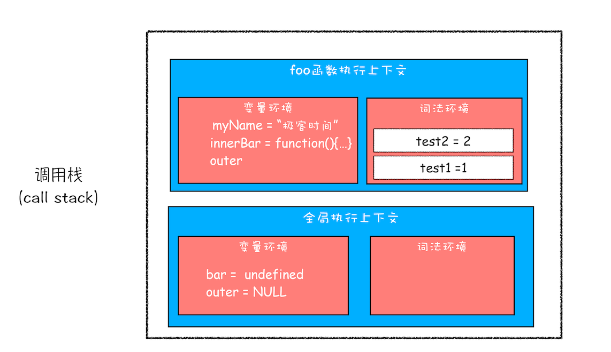

<style>
  /* body { background-color: #000 !important; } */
  /* h1,h2,h3,h4,h5,h6,h7,p { color: #999 !important; } */
  /* h3 {
    display: inline-flex;
    align-items: center;
    font-weight: 700;
    color: #fff;
    background: linear-gradient(#fff 50%,#fc625d 80%);
    padding: 3px 10px 4px;
    border-top-right-radius: 3px;
    border-top-left-radius: 3px;
    margin-right: 3px;
    font-size: 20px;
    margin-top: -1.1rem !important;
  } */
  h3 {
    font-size: 20px;
  }
  h3:before {
    content: "";
    border-bottom: 2px solid #ef7060;
    width: 100%;
    display: block;
    height: 10px;
    position: absolute;
    margin-top: 21px;
  }
  b {
    color: red;
  }
</style>

## 先看总体概览！！

- 调用栈
- 执行上下文
- 变量提升
- 变量环境
- 词法环境
- 可执行代码
- outer
- this
- 作用域
- 作用域链
- 词法作用域
- 闭包
- 原型
- 原型链

## 编译型语言和解释型语言的区别？

**编译型语言**： <font color="red">**在程序执行之前必须进行专门的编译过程**</font>，有如下特点：

- 只须编译一次就可以把源代码编译成机器语言，后面的执行无须重新编译，直接使用之前的编译结果就可以；因此其执行的效率比较高；
- 编译性语言代表：C、C++、Java、Pascal/Object Pascal（Delphi）；
- 程序执行效率比较高，但比较依赖编译器，因此跨平台性差一些；
- 不同平台对编译器影响较大。
  - 16 位系统下 int 是 2 个字节（16 位），而 32 位系统下 int 占 4 个字节（32 位）；
  - 32 位系统下 long 类型占 4 字节，而 64 位系统下 long 类型占 8 个字节；

**解释型语言**： 解释执行，支持动态类型，弱类型，<font color="red">**在程序运行的时候才进行编译**，</font>而编译前需要确定变量的类型，效率相对比较低，对不同系统平台有较大的兼容性.

- 源代码不能直接翻译成机器语言，而是先翻译成中间代码，再由解释器对中间代码进行解释运行；
  - 源代码—><font color="red">**中间代码**</font>—>机器语言
- 程序不需要编译，程序在运行时才翻译成机器语言，每执行一次都要翻译一次；
- 解释性语言代表：Python、JavaScript、Shell、Ruby、MATLAB 等；
- 运行效率一般相对比较低，依赖解释器，跨平台性好；

## V8 工作原理（执行一段 JS 代码的机制）？

**V8 引擎** 是一个谷歌的一个开源 JavaScript 引擎实现。

要深入**V8 工作原理**，要理解以下涉及概念：

- **编译器**（Compiler)
- **解释器**（Interpreter）
- **抽象语法树**（AST）
- **字节码**（Bytecode）
- **即时编译器**（JIT）等

### 编译器 和 解释器

之所以存在**编译器** 和 **解释器**，是因为机器不能直接理解我们所写的代码，所以在执行程序之前，需要将我们所写的代码“翻译”成机器能读懂的机器语言。按语言的执行流程，可以把语言划分为**编译型语言** 和 **解释型语言**。

- 编译型语言在程序执行之前，需要经过编译器的编译过程，并且编译之后会直接保留机器能读懂的二进制文件，这样每次运行程序时，都可以直接运行该二进制文件，而不需要再次重新编译了。比如 C/C++、GO 等都是编译型语言。

- 而由解释型语言编写的程序，在每次运行时都需要通过解释器对程序进行动态解释和执行。比如 Python、JavaScript 等都属于解释型语言。

具体流程如下：


### V8 是如何执行一段 JavaScript 代码的


从图中可以清楚地看到，V8 在执行过程中既有<font color="red">**解释器 Ignition**</font>，又有<font color="red">**编译器 TurboFan**</font>，那么它们是如何配合去执行一段 JavaScript 代码的呢? 下面我们就按照上图来一一分解其执行流程。

1. **生成抽象语法树（AST）和 执行上下文 阶段**

   经过 <b>词法分析</b> 和 <b>语法分析</b> 生成 AST 和 执行上下文。

2. **生成字节码阶段**

   <b>解释器 Ignition</b> 就登场了，它会根据 AST 生成字节码，并解释执行字节码。

那什么是字节码呢？为什么引入字节码就能解决内存占用问题呢？

<b>字节码</b>就是介于 AST 和机器码之间的一种代码。但是与特定类型的机器码无关，字节码需要通过解释器将其转换为机器码后才能执行。

理解了什么是字节码，我们再来对比下高级代码、字节码和机器码，你可以参考下图


3. **执行代码阶段**

通常，如果有一段第一次执行的字节码，**解释器 Ignition** 会逐条解释执行。在执行字节码的过程中，如果发现有 **热点代码（HotSpot）**，比如一段代码被重复执行多次，这种就称为热点代码，那么后台的 **编译器 TurboFan** 就会把该段热点的字节码编译为高效的机器码，然后当再次执行这段被优化的代码时，只需要执行编译后的机器码就可以了，这样就大大提升了代码的执行效率。

其实字节码配合解释器和编译器是最近一段时间很火的技术，比如 Java 和 Python 的虚拟机也都是基于这种技术实现的，我们把这种技术称为 <b>即时编译（JIT）</b>

V8 和 很多工作引擎都使用了 <b>“字节码 +JIT”技术</b> 流程图如下：


## JS 的执行上下文？

**执行上下文**就是当前 `JavaScript` 代码被 **解析** 和 **执行** 时`所在环境的抽象概念`， `JavaScript` 中运行任何的代码都是在**执行上下文**中运行。

> **执行上下文的类型：**

1. **全局执行上下文：** 这是默认的、最基础的执行上下文。不在任何函数中的代码都位于全局执行上下文中。它做了两件事：

   1. 创建一个全局对象，在浏览器中这个全局对象就是 window 对象。
   2. 将 this 指针指向这个全局对象。一个程序中只能存在一个全局执行上下文。

2. **函数执行上下文：** 每次调用函数时，都会为该函数创建一个新的执行上下文。每个函数都拥有自己的执行上下文，但是只有在函数被调用的时候才会被创建。一个程序中可以存在任意数量的函数执行上下文。每当一个新的执行上下文被创建，它都会按照特定的顺序执行一系列步骤，具体过程将在本文后面讨论。

3. **Eval 函数执行上下文：** 运行在 eval 函数中的代码也获得了自己的执行上下文，但由于 Javascript 开发人员不常用 eval 函数，所以在这里不再讨论。

## 变量提升：JS 代码并不是按照顺序执行的？

### 变量提升

在介绍变量提升之前，我们先通过下面这段代码，来看看什么是 JavaScript 中的声明和赋值。

```js
var myname = "极客时间";
```

这段代码你可以把它看成是两行代码组成的：

```js
var myname; //声明部分
myname = "极客时间"; //赋值部分
```


上面是变量的声明和赋值，那接下来我们再来看看函数的声明和赋值，结合下面这段代码

```js
function foo() {
  console.log("foo");
}

var bar = function () {
  console.log("bar");
};
```

第一个函数 foo 是一个完整的函数声明，也就是说没有涉及到赋值操作；第二个函数是先声明变量 bar，再把 function(){console.log('bar')}赋值给 bar。为了直观理解，你可以参考下图：


好了，理解了声明和赋值操作，那接下来我们就可以聊聊什么是变量提升了。

**所谓的变量提升，是指在 JavaScript 代码执行过程中，JavaScript 引擎把变量的声明部分和函数的声明部分提升到代码开头的“行为”。变量被提升后，会给变量设置默认值，这个默认值就是我们熟悉的 undefined。**

下面我们来模拟下实现：

```js
/*
 * 变量提升部分
 */
// 把变量 myname提升到开头，
// 同时给myname赋值为undefined
var myname = undefined;
// 把函数showName提升到开头
function showName() {
  console.log("showName被调用");
}

/*
 * 可执行代码部分
 */
showName();
console.log(myname);
// 去掉var声明部分，保留赋值语句
myname = "极客时间";
```

为了模拟变量提升的效果，我们对代码做了以下调整，如下图：


从图中可以看出，对原来的代码主要做了两处调整：

- 第一处是把声明的部分都提升到了代码开头，如变量<b>myname</b>和函数<b>showName</b>，并给变量设置默认值<b>undefined</b>；
- 第二处是移除原本声明的变量和函数，如 var myname = '极客时间'的语句，移除了<b>var</b>声明，整个移除<b>showName</b>的函数声明。
- 通过这两步，就可以实现变量提升的效果。你也可以执行这段模拟变量提升的代码，其输出结果和第一段代码应该是完全一样的。

通过这段模拟的变量提升代码，相信你已经明白了可以在定义之前使用变量或者函数的原因——函数和变量在执行之前都提升到了代码开头。

### JS 代码的执行流程

从概念的字面意义上来看，“变量提升”意味着变量和函数的声明会在物理层面移动到代码的最前面，正如我们所模拟的那样。但，这并不准确。实际上变量和函数声明在代码里的位置是不会改变的，而且是在编译阶段被 JavaScript 引擎放入内存中。对，你没听错，一段 JavaScript 代码在执行之前需要被 JavaScript 引擎编译，编译完成之后，才会进入执行阶段。大致流程你可以参考下图：


1. **编译阶段**

那么编译阶段和变量提升存在什么关系呢？

为了搞清楚这个问题，我们还是回过头来看上面那段模拟变量提升的代码，为了方便介绍，可以把这段代码分成两部分。

**第一部分：变量提升部分的代码。**

```js
var myname = undefined;
function showName() {
  console.log("函数showName被执行");
}
```

**第二部分：执行部分的代码。**

```js
showName();
console.log(myname);
myname = "极客时间";
```

下面我们就可以把 JavaScript 的执行流程细化，如下图所示：


从上图可以看出，输入一段代码，经过编译后，会生成两部分内容：**执行上下文（Execution context）**和**可执行代码**。

执行上下文是 JavaScript 执行一段代码时的运行环境，比如调用一个函数，就会进入这个函数的执行上下文，确定该函数在执行期间用到的诸如 this、变量、对象以及函数等。

关于执行上下文的细节，我会在下一篇文章《08 | 调用栈：为什么 JavaScript 代码会出现栈溢出？》做详细介绍，现在你只需要知道，在执行上下文中存在一个变量环境的对象（Viriable Environment），该对象中保存了变量提升的内容，比如上面代码中的变量 myname 和函数 showName，都保存在该对象中。

你可以简单地把变量环境对象看成是如下结构

```js
VariableEnvironment:
     myname -> undefined,
     showName ->function : {console.log(myname)
```

了解完变量环境对象的结构后，接下来，我们再结合下面这段代码来分析下是如何生成变量环境对象的。

```js
showName();
console.log(myname);
var myname = "极客时间";
function showName() {
  console.log("函数showName被执行");
}
```

我们可以一行一行来分析上述代码：

- 第 1 行和第 2 行，由于这两行代码不是声明操作，所以 JavaScript 引擎不会做任何处理；
- 第 3 行，由于这行是经过 var 声明的，因此 JavaScript 引擎将在环境对象中创建一个名为 myname 的属性，并使用 undefined 对其初始化；
- 第 4 行，JavaScript 引擎发现了一个通过 function 定义的函数，所以它将函数定义存储到堆(HEAP）中，并在环境对象中创建一个 showName 的属性，然后将该属性值指向堆中函数的位置（不了解堆也没关系，JavaScript 的执行堆和执行栈我会在后续文章中介绍）。 这样就生成了变量环境对象。接下来 JavaScript 引擎会把声明以外的代码编译为字节码，至于字节码的细节，我也会在后面文章中做详细介绍，你可以类比如下的模拟代码

```js
showName();
console.log(myname);
myname = "极客时间";
```

好了，现在有了执行上下文和可执行代码了，那么接下来就到了执行阶段了。

2. **执行阶段**

JavaScript 引擎开始执行“可执行代码”，按照顺序一行一行地执行。下面我们就来一行一行分析下这个执行过程

- 当执行到 showName 函数时，JavaScript 引擎便开始在变量环境对象中查找该函数，由于变量环境对象中存在该函数的引用，所以 JavaScript 引擎便开始执行该函数，并输出“函数 showName 被执行”结果。
- 接下来打印“myname”信息，JavaScript 引擎继续在变量环境对象中查找该对象，由于变量环境存在 myname 变量，并且其值为 undefined，所以这时候就输出 undefined。
- 接下来执行第 3 行，把“极客时间”赋给 myname 变量，赋值后变量环境中的 myname 属性值改变为“极客时间”，变量环境如下所示

```js
VariableEnvironment:
     myname -> "极客时间",
     showName ->function : {console.log(myname)
```

好了，以上就是一段代码的编译和执行流程。实际上，编译阶段和执行阶段都是非常复杂的，包括了词法分析、语法解析、代码优化、代码生成等，这些内容我会在《14 | 编译器和解释器：V8 是如何执行一段 JavaScript 代码的？》那节详细介绍，在本篇文章中你只需要知道 JavaScript 代码经过编译生成了什么内容就可以了

### 总结

- JavaScript 代码执行过程中，需要先做变量提升，而之所以需要实现变量提升，是因为 JavaScript 代码在执行之前需要先编译。 在编译阶段，变量和函数会被存放到变量环境中，变量的默认值会被设置为 undefined；在代码执行阶段，JavaScript 引擎会从变量环境中去查找自定义的变量和函数。
- 如果在编译阶段，存在两个相同的函数，那么最终存放在变量环境中的是最后定义的那个，这是因为后定义的会覆盖掉之前定义的。
  以上就是今天所讲的主要内容，当然，学习这些内容并不是让你掌握一些 JavaScript 小技巧，其主要目的是让你清楚 JavaScript 的执行机制：先编译，再执行。

### 思考

```js
showName();
var showName = function () {
  console.log(2);
};
function showName() {
  console.log(1);
}
```

编译阶段：

```js
var showName;
function showName() {
  console.log(1);
}
```

执行阶段:

```js
showName(); //输出1
showName = function () {
  console.log(2);
};
//如果后面再有showName执行的话，就输出2因为这时候函数引用已经变了
```

## 调用栈：为什么 JS 代码会出现栈溢出？

在写 JavaScript 代码的时候，有时候可能会遇到栈溢出的错误，如下图所示：


那为什么会出现这种错误呢？这就涉及到了调用栈的内容。你应该知道 JavaScript 中有很多函数，经常会出现在一个函数中调用另外一个函数的情况，调用栈就是用来管理函数调用关系的一种数据结构。因此要讲清楚调用栈，你还要先弄明白函数调用和栈结构

### 函数调用

函数调用就是运行一个函数，具体使用方式是使用函数名称跟着一对小括号。下面我们看个简单的示例代码

```js
var a = 2;
function add() {
  var b = 10;
  return a + b;
}
add();
```

这段代码很简单，先是创建了一个 add 函数，接着在代码的最下面又调用了该函数。

那么下面我们就利用这段简单的代码来解释下函数调用的过程。

在执行到函数 add()之前，JavaScript 引擎会为上面这段代码创建全局执行上下文，包含了声明的函数和变量，你可以参考下图：


从图中可以看出，代码中全局变量和函数都保存在全局上下文的变量环境中。

执行上下文准备好之后，便开始执行全局代码，当执行到 add 这儿时，JavaScript 判断这是一个函数调用，那么将执行以下操作：

1. 首先，从全局执行上下文中，取出 add 函数代码。
2. 其次，对 add 函数的这段代码进行编译，并创建该函数的执行上下文和可执行代码。
3. 最后，执行代码，输出结果。

完整流程你可以参考下图：


就这样，当执行到 add 函数的时候，我们就有了两个执行上下文了——全局执行上下文和 add 函数的执行上下文。

也就是说在执行 JavaScript 时，可能会存在多个执行上下文，那么 JavaScript 引擎是如何管理这些执行上下文的呢？

答案是通过一种叫**栈的数据结构**来管理的。那什么是栈呢？它又是如何管理这些执行上下文呢？

### 栈

栈就是类似于一端被堵住的单行线，车子类似于栈中的元素，栈中的元素满足后进先出的特点。你可以参看下图：


### JavaScript 的调用栈

JavaScript 引擎正是利用栈的这种结构来管理执行上下文的。在执行上下文创建好后，JavaScript 引擎会将执行上下文压入栈中，通常把这种用来管理执行上下文的栈称为执行上下文栈，又称**调用栈**。

为便于你更好地理解调用栈，下面我们再来看段稍微复杂点的示例代码：

```js
var a = 2;
function add(b, c) {
  return b + c;
}
function addAll(b, c) {
  var d = 10;
  result = add(b, c);
  return a + result + d;
}
addAll(3, 6);
```

在上面这段代码中，你可以看到它是在 addAll 函数中调用了 add 函数，那在整个代码的执行过程中，调用栈是怎么变化的呢？

下面我们就一步步地分析在代码的执行过程中，调用栈的状态变化情况。

**第一步，创建全局上下文，并将其压入栈底。**如下图所示


从图中你也可以看出，变量 a、函数 add 和 addAll 都保存到了全局上下文的变量环境对象中。

全局执行上下文压入到调用栈后，JavaScript 引擎便开始执行全局代码了。首先会执行 a=2 的赋值操作，执行该语句会将全局上下文变量环境中 a 的值设置为 2。设置后的全局上下文的状态如下图所示：


接下来，**第二步是调用 addAll 函数。**当调用该函数时，JavaScript 引擎会编译该函数，并为其创建一个执行上下文，最后还将该函数的执行上下文压入栈中，如下图所示：


addAll 函数的执行上下文创建好之后，便进入了函数代码的执行阶段了，这里先执行的是 d=10 的赋值操作，执行语句会将 addAll 函数执行上下文中的 d 由 undefined 变成了 10。

然后接着往下执行，**第三步，当执行到 add 函数调用语句时，同样会为其创建执行上下文，并将其压入调用栈，**如下图所示：


当 add 函数返回时，该函数的执行上下文就会从栈顶弹出，并将 result 的值设置为 add 函数的返回值，也就是 9。如下图所示


紧接着 addAll 执行最后一个相加操作后并返回，addAll 的执行上下文也会从栈顶部弹出，此时调用栈中就只剩下全局上下文了。最终如下图所示：


至此，整个 JavaScript 流程执行结束了。

好了，现在你应该知道了**调用栈是 JavaScript 引擎追踪函数执行的一个机制**，当一次有多个函数被调用时，通过调用栈就能够追踪到哪个函数正在被执行以及各函数之间的调用关系。

### 总结

- 每调用一个函数，JavaScript 引擎会为其创建执行上下文，并把该执行上下文压入调用栈，然后 JavaScript 引擎开始执行函数代码。
- 如果在一个函数 A 中调用了另外一个函数 B，那么 JavaScript 引擎会为 B 函数创建执行上下文，并将 B 函数的执行上下文压入栈顶。
- 当前函数执行完毕后，JavaScript 引擎会将该函数的执行上下文弹出栈。
- 当分配的调用栈空间被占满时，会引发“堆栈溢出”问题。
- 栈是一种非常重要的数据结构，不光应用在 JavaScript 语言中，其他的编程语言，如 C/C++、Java、Python 等语言，在执行过程中也都使用了栈来管理函数之间的调用关系。所以栈是非常基础且重要的知识点，你必须得掌握。

### 思考

```js
function runStack(n) {
  if (n === 0) return 100;
  return runStack(n - 2);
}
runStack(50000);
```

这是一段递归代码，可以通过传入参数 n，让代码递归执行 n 次，也就意味着调用栈的深度能达到 n，当输入一个较大的数时，比如 50000，就会出现栈溢出的问题，那么你能优化下这段代码，以解决栈溢出的问题吗？

```js
// 优化
function runStack(n) {
  while (true) {
    if (n === 0) {
      return 100;
    }

    if (n === 1) {
      // 防止陷入死循环
      return 200;
    }

    n = n - 2;
  }
}
console.log(runStack(50000));
```

## 作用域：var 缺陷以及为什么引入 let 和 const？

虽然 ECMAScript6（以下简称 ES6）已经通过引入块级作用域并配合 let、const 关键字，来避开了这种设计缺陷，但是由于 JavaScript 需要保持向下兼容，所以变量提升在相当长一段时间内还会继续存在。这也加大了你理解概念的难度，因为既要理解新的机制，又要理解变量提升这套机制，关键这两套机制还是同时运行在“一套”系统中的。

但如果抛开 JavaScript 的底层去理解这些，那么你大概率会很难深入理解其概念。俗话说，“断病要断因，治病要治根”，所以为了便于你更好地理解和学习，今天我们这篇文章会先“探病因”——分析为什么在 JavaScript 中会存在变量提升，以及变量提升所带来的问题；然后再来“开药方”——介绍如何通过块级作用域并配合 let 和 const 关键字来修复这种缺陷

### 作用域（scope）

**作用域是指在程序中定义变量的区域，该位置决定了变量的生命周期。通俗地理解，作用域就是变量与函数的可访问范围，即作用域控制着变量和函数的可见性和生命周期**

在 ES6 之前，ES 的作用域只有两种：**全局作用域**和**函数作用域**。

- 全局作用域中的对象在代码中的任何地方都能访问，其生命周期伴随着页面的生命周期。
- 函数作用域就是在函数内部定义的变量或者函数，并且定义的变量或者函数只能在函数内部被访问。函数执行结束之后，函数内部定义的变量会被销毁。

在 ES6 之前，JavaScript 只支持这两种作用域，相较而言，其他语言则都普遍支持块级作用域。块级作用域就是使用一对大括号包裹的一段代码，比如函数、判断语句、循环语句，甚至单独的一个{}都可以被看作是一个块级作用域。

为了更好地理解块级作用域，你可以参考下面的一些示例代码：

```js
//if块
if(1){}

//while块
while(1){}

//函数块
function foo(){

//for循环块
for(let i = 0; i<100; i++){}

//单独一个块
{}
```

### 变量提升所带来的问题

由于变量提升作用，使用 JavaScript 来编写和其他语言相同逻辑的代码，都有可能会导致不一样的执行结果。那为什么会出现这种情况呢？主要有以下两种原因。

#### 1. 变量容易在不被察觉的情况下被覆盖掉

比如我们重新使用 JavaScript 来实现上面那段 C 代码，实现后的 JavaScript 代码如下：

#### 2. 本应销毁的变量没有被销毁

```js
function foo() {
  for (var i = 0; i < 7; i++) {}
  console.log(i);
}
foo();
```

如果你使用 C 语言或者其他的大部分语言实现类似代码，在 for 循环结束之后，i 就已经被销毁了，但是在 JavaScript 代码中，i 的值并未被销毁，所以最后打印出来的是 7。

这同样也是由变量提升而导致的，在创建执行上下文阶段，变量 i 就已经被提升了，所以当 for 循环结束之后，变量 i 并没有被销毁。

这依旧和其他支持块级作用域的语言表现是不一致的，所以必然会给一些人造成误解。

### ES6 是如何解决变量提升带来的缺陷

上面我们介绍了变量提升而带来的一系列问题，为了解决这些问题，ES6 引入了 let 和 const 关键字，从而使 JavaScript 也能像其他语言一样拥有了块级作用域。

那么接下来，我们就通过实际的例子来分析下，ES6 是如何通过块级作用域来解决上面的问题的？

你可以先参考下面这段存在变量提升的代码

```js
function varTest() {
  var x = 1;
  if (true) {
    var x = 2; // 同样的变量!
    console.log(x); // 2
  }
  console.log(x); // 2
}
```

在这段代码中，有两个地方都定义了变量 x，第一个地方在函数块的顶部，第二个地方在 if 块的内部，由于 var 的作用范围是整个函数，所以在编译阶段，会生成如下的执行上下文：


从执行上下文的变量环境中可以看出，最终只生成了一个变量 x，函数体内所有对 x 的赋值操作都会直接改变变量环境中的 x 值。

所以上述代码最后通过 console.log(x)输出的是 2，而对于相同逻辑的代码，其他语言最后一步输出的值应该是 1，因为在 if 块里面的声明不应该影响到块外面的变量。

既然支持块级作用域和不支持块级作用域的代码执行逻辑是不一样的，那么接下来我们就来改造上面的代码，让其支持块级作用域。

这个改造过程其实很简单，只需要把 var 关键字替换为 let 关键字，改造后的代码如下

```js
function letTest() {
  let x = 1;
  if (true) {
    let x = 2; // 不同的变量
    console.log(x); // 2
  }
  console.log(x); // 1
}
```

执行这段代码，其输出结果就和我们的预期是一致的。这是因为 let 关键字是支持块级作用域的，所以在编译阶段，JavaScript 引擎并不会把 if 块中通过 let 声明的变量存放到变量环境中，这也就意味着在 if 块通过 let 声明的关键字，并不会提升到全函数可见。所以在 if 块之内打印出来的值是 2，跳出语块之后，打印出来的值就是 1 了。这种就非常符合我们的编程习惯了：**作用块内声明的变量不影响块外面的变量。**

### JS 是如何支持块级作用域的

现在你知道了 ES 可以通过使用 let 或者 const 关键字来实现块级作用域，不过你是否有过这样的疑问：“在同一段代码中，ES6 是如何做到既要支持变量提升的特性，又要支持块级作用域的呢？”

那么接下来，我们就要站在执行上下文的角度来揭开答案。

你已经知道 JavaScript 引擎是通过变量环境实现函数级作用域的，那么 ES6 又是如何在函数级作用域的基础之上，实现对块级作用域的支持呢？你可以先看下面这段代码

```js
function foo() {
  var a = 1;
  let b = 2;
  {
    let b = 3;
    var c = 4;
    let d = 5;
    console.log(a);
    console.log(b);
  }
  console.log(b);
  console.log(c);
  console.log(d);
}
foo();
```

当执行上面这段代码的时候，JavaScript 引擎会先对其进行编译并创建执行上下文，然后再按照顺序执行代码，关于如何创建执行上下文我们在前面的文章中已经分析过了，但是现在的情况有点不一样，我们引入了 let 关键字，let 关键字会创建块级作用域，那么 let 关键字是如何影响执行上下文的呢？

接下来我们就来一步步分析上面这段代码的执行流程。

**第一步是编译并创建执行上下文**，下面是我画出来的执行上下文示意图，你可以参考下

通过上图，我们可以得出以下结论：

- <b>函数内部通过 var 声明的变量，在编译阶段全都被存放到变量环境里面了。</b>
- <b>通过 let 声明的变量，在编译阶段会被存放到词法环境（Lexical Environment）中。</b>
- 在函数的作用域内部，通过 let 声明的变量并没有被存放到词法环境中。
- 接下来，第二步继续执行代码，当执行到代码块里面时，变量环境中 a 的值已经被设置成了 1，词法环境中 b 的值已经被设置成了 2，

这时候函数的执行上下文就如下图所示：


从图中可以看出，当进入函数的作用域块时，作用域块中通过 let 声明的变量，会被存放在词法环境的一个单独的区域中，这个区域中的变量并不影响作用域块外面的变量，比如在作用域外面声明了变量 b，在该作用域块内部也声明了变量 b，当执行到作用域内部时，它们都是独立的存在。

其实，在词法环境内部，维护了一个小型栈结构，栈底是函数最外层的变量，进入一个作用域块后，就会把该作用域块内部的变量压到栈顶；当作用域执行完成之后，该作用域的信息就会从栈顶弹出，这就是词法环境的结构。需要注意下，我这里所讲的变量是指通过 let 或者 const 声明的变量。

再接下来，当执行到作用域块中的 console.log(a)这行代码时，就需要在词法环境和变量环境中查找变量 a 的值了，具体查找方式是：沿着词法环境的栈顶向下查询，如果在词法环境中的某个块中查找到了，就直接返回给 JavaScript 引擎，如果没有查找到，那么继续在变量环境中查找。

这样一个变量查找过程就完成了，你可以参考下图：

从上图你可以清晰地看出变量查找流程，不过要完整理解查找变量或者查找函数的流程，就涉及到作用域链了，这个我们会在下篇文章中做详细介绍。

当作用域块执行结束之后，其内部定义的变量就会从词法环境的栈顶弹出，最终执行上下文如下图所示：

通过上面的分析，想必你已经理解了词法环境的结构和工作机制，块级作用域就是通过词法环境的栈结构来实现的，而变量提升是通过变量环境来实现，通过这两者的结合，JavaScript 引擎也就同时支持了变量提升和块级作用域了。

### 总结

由于 JavaScript 的变量提升存在着**变量覆盖**、**变量污染**等设计缺陷，所以 ES6 引入了**块级作用域**关键字来解决这些问题。

之后我们还通过对**变量环境**和**词法环境**的介绍，分析了 JavaScript 引擎是如何<b>同时支持变量提升和块级作用域的</b>。

## 作用域链：代码中出现相同的变量，JS 引擎该如何选择？

理解作用域链是理解闭包的基础，而闭包在 JavaScript 中几乎无处不在，同时作用域和作用域链还是所有编程语言的基础。所以，如果你想学透一门语言，作用域和作用域链一定是绕不开的

那今天我们就来聊聊什么是作用域链，并通过作用域链再来讲讲什么是闭包。

首先我们来看下面这段代码：

```js
function bar() {
  console.log(myName);
}
function foo() {
  var myName = " 极客邦 ";
  bar();
}
var myName = " 极客时间 ";
foo();
```

你觉得这段代码中的 bar 函数和 foo 函数打印出来的内容是什么？这就要分析下这两段代码的执行流程。

通过前面几篇文章的学习，想必你已经知道了如何通过执行上下文来分析代码的执行流程了。那么当这段代码执行到 bar 函数内部时，其调用栈的状态图如下所示：


从图中可以看出，全局执行上下文和 foo 函数的执行上下文中都包含变量 myName，那 bar 函数里面 myName 的值到底该选择哪个呢？

也许你的第一反应是按照调用栈的顺序来查找变量，查找方式如下：

1. 先查找栈顶是否存在 myName 变量，但是这里没有，所以接着往下查找 foo 函数中的变量。
2. 在 foo 函数中查找到了 myName 变量，这时候就使用 foo 函数中的 myName。

如果按照这种方式来查找变量，那么最终执行 bar 函数打印出来的结果就应该是“极客邦”。但实际情况并非如此，如果你试着执行上述代码，你会发现打印出来的结果是“极客时间”。为什么会是这种情况呢？要解释清楚这个问题，那么你就需要先搞清楚作用域链了

### 作用域链

关于作用域链，很多人会感觉费解，但如果你理解了调用栈、执行上下文、词法环境、变量环境等概念，那么你理解起来作用域链也会很容易。所以很是建议你结合前几篇文章将上面那几个概念学习透彻。

<b>其实在每个执行上下文的变量环境中，都包含了一个外部引用，用来指向外部的执行上下文，我们把这个外部引用称为 outer。</b>

当一段代码使用了一个变量时，JavaScript 引擎首先会在“当前的执行上下文”中查找该变量， 比如上面那段代码在查找 myName 变量时，如果在当前的变量环境中没有查找到，那么 JavaScript 引擎会继续在 outer 所指向的执行上下文中查找。为了直观理解，你可以看下面这张图


从图中可以看出，bar 函数和 foo 函数的 outer 都是指向全局上下文的，这也就意味着如果在 bar 函数或者 foo 函数中使用了外部变量，那么 JavaScript 引擎会去全局执行上下文中查找。我们把这个查找的链条就称为作用域链。

现在你知道变量是通过作用域链来查找的了，不过还有一个疑问没有解开，foo 函数调用的 bar 函数，那为什么 bar 函数的外部引用是全局执行上下文，而不是 foo 函数的执行上下文？

要回答这个问题，你还需要知道什么是词法作用域。<b>这是因为在 JavaScript 执行过程中，其作用域链是由词法作用域决定的</b>

### 词法作用域

> <b>词法作用域就是指作用域是由代码中函数声明的位置来决定的，所以词法作用域是静态的作用域，通过它就能够预测代码在执行过程中如何查找标识符</b>

这么讲可能不太好理解，你可以看下面这张图


从图中可以看出，词法作用域就是根据代码的位置来决定的，其中 main 函数包含了 bar 函数，bar 函数中包含了 foo 函数，因为 JavaScript 作用域链是由词法作用域决定的，所以整个词法作用域链的顺序是：foo 函数作用域—>bar 函数作用域—>main 函数作用域—> 全局作用域。

了解了词法作用域以及 JavaScript 中的作用域链，我们再回过头来看看上面的那个问题：在开头那段代码中，foo 函数调用了 bar 函数，那为什么 bar 函数的外部引用是全局执行上下文，而不是 foo 函数的执行上下文?

这是因为根据词法作用域，foo 和 bar 的上级作用域都是全局作用域，所以如果 foo 或者 bar 函数使用了一个它们没有定义的变量，那么它们会到全局作用域去查找。也就是说，<b>词法作用域是代码阶段就决定好的，和函数是怎么调用的没有关系</b>

### 块级作用域中的变量查找

前面我们通过全局作用域和函数级作用域来分析了作用域链，那接下来我们再来看看块级作用域中变量是如何查找的？在编写代码的时候，如果你使用了一个在当前作用域中不存在的变量，这时 JavaScript 引擎就需要按照作用域链在其他作用域中查找该变量，如果你不了解该过程，那就会有很大概率写出不稳定的代码。

我们还是先看下面这段代码：

```js
function bar() {
  var myName = " 极客世界 ";
  let test1 = 100;
  if (1) {
    let myName = "Chrome 浏览器 ";
    console.log(test);
  }
}
function foo() {
  var myName = " 极客邦 ";
  let test = 2;
  {
    let test = 3;
    bar();
  }
}
var myName = " 极客时间 ";
let myAge = 10;
let test = 1;
foo();
```

你可以自己先分析下这段代码的执行流程，看看能否分析出来执行结果。

要想得出其执行结果，那接下来我们就得站在作用域链和词法环境的角度来分析下其执行过程。

在上篇文章中我们已经介绍过了，ES6 是支持块级作用域的，当执行到代码块时，如果代码块中有 let 或者 const 声明的变量，那么变量就会存放到该函数的词法环境中。对于上面这段代码，当执行到 bar 函数内部的 if 语句块时，其调用栈的情况如下图所示：

现在是执行到 bar 函数的 if 语块之内，需要打印出来变量 test，那么就需要查找到 test 变量的值，其查找过程我已经在上图中使用序号 1、2、3、4、5 标记出来了。

下面我就来解释下这个过程。首先是在 bar 函数的执行上下文中查找，但因为 bar 函数的执行上下文中没有定义 test 变量，所以根据词法作用域的规则，下一步就在 bar 函数的外部作用域中查找，也就是全局作用域。

至于单个执行上下文中如何查找变量，我在上一篇文章中已经做了介绍，这里就不重复了

## 闭包

先来看概念：<b>在 JavaScript 中，根据词法作用域的规则，内部函数总是可以访问其外部函数中声明的变量，当通过调用一个外部函数返回一个内部函数后，即使该外部函数已经执行结束了，但是内部函数引用外部函数的变量依然保存在内存中，我们就把这些变量的集合称为闭包。</b>

理解了变量环境、词法环境和作用域链等概念，那接下来你再理解什么是 JavaScript 中的闭包就容易多了。这里你可以结合下面这段代码来理解什么是闭包：

```js
function foo() {
  var myName = " 极客时间 ";
  let test1 = 1;
  const test2 = 2;
  var innerBar = {
    getName: function () {
      console.log(test1);
      return myName;
    },
    setName: function (newName) {
      myName = newName;
    },
  };
  return innerBar;
}
var bar = foo();
bar.setName(" 极客邦 ");
bar.getName();
console.log(bar.getName());
```

首先我们看看当执行到 foo 函数内部的 return innerBar 这行代码时调用栈的情况，你可以参考下图：


从上面的代码可以看出，innerBar 是一个对象，包含了 getName 和 setName 的两个方法（通常我们把对象内部的函数称为方法）。你可以看到，这两个方法都是在 foo 函数内部定义的，并且这两个方法内部都使用了 myName 和 test1 两个变量。

<b>根据词法作用域的规则，内部函数 getName 和 setName 总是可以访问它们的外部函数 foo 中的变量</b>，所以当 innerBar 对象返回给全局变量 bar 时，虽然 foo 函数已经执行结束，但是 getName 和 setName 函数依然可以使用 foo 函数中的变量 myName 和 test1。所以当 foo 函数执行完成之后，其整个调用栈的状态如下图所示：


从上图可以看出，foo 函数执行完成之后，其执行上下文从栈顶弹出了，但是由于返回的 setName 和 getName 方法中使用了 foo 函数内部的变量 myName 和 test1，所以这两个变量依然保存在内存中。这像极了 setName 和 getName 方法背的一个专属背包，无论在哪里调用了 setName 和 getName 方法，它们都会背着这个 foo 函数的专属背包。

之所以是专属背包，是因为除了 setName 和 getName 函数之外，其他任何地方都是无法访问该背包的，我们就可以把这个背包称为 foo 函数的闭包。

好了，现在我们终于可以给闭包一个正式的定义了。<b>在 JavaScript 中，根据词法作用域的规则，内部函数总是可以访问其外部函数中声明的变量，当通过调用一个外部函数返回一个内部函数后，即使该外部函数已经执行结束了，但是内部函数引用外部函数的变量依然保存在内存中，我们就把这些变量的集合称为闭包。</b>比如外部函数是 foo，那么这些变量的集合就称为 foo 函数的闭包。

那这些闭包是如何使用的呢？当执行到 bar.setName 方法中的 myName = "极客邦"这句代码时，JavaScript 引擎会沿着“当前执行上下文–>foo 函数闭包–> 全局执行上下文”的顺序来查找 myName 变量，你可以参考下面的调用栈状态图：


从图中可以看出，setName 的执行上下文中没有 myName 变量，foo 函数的闭包中包含了变量 myName，所以调用 setName 时，会修改 foo 闭包中的 myName 变量的值。

同样的流程，当调用 bar.getName 的时候，所访问的变量 myName 也是位于 foo 函数闭包中的。

你也可以通过“开发者工具”来看看闭包的情况，打开 Chrome 的“开发者工具”，在 bar 函数任意地方打上断点，然后刷新页面，可以看到如下内容：

从图中可以看出来，当调用 bar.getName 的时候，右边 Scope 项就体现出了作用域链的情况：Local 就是当前的 getName 函数的作用域，Closure(foo) 是指 foo 函数的闭包，最下面的 Global 就是指全局作用域，从“Local–>Closure(foo)–>Global”就是一个完整的作用域链。

所以说，你以后也可以通过 Scope 来查看实际代码作用域链的情况，这样调试代码也会比较方便。

### 闭包是怎么回收的？

理解什么是闭包之后，接下来我们再来简单聊聊闭包是什么时候销毁的。因为如果闭包使用不正确，会很容易造成内存泄漏的，关注闭包是如何回收的能让你正确地使用闭包。

通常，如果引用闭包的函数是一个全局变量，那么闭包会一直存在直到页面关闭；但如果这个闭包以后不再使用的话，就会造成内存泄漏。

如果引用闭包的函数是个局部变量，等函数销毁后，在下次 JavaScript 引擎执行垃圾回收时，判断闭包这块内容如果已经不再被使用了，那么 JavaScript 引擎的垃圾回收器就会回收这块内存。

所以在使用闭包的时候，你要尽量注意一个原则：<b>如果该闭包会一直使用，那么它可以作为全局变量而存在；但如果使用频率不高，而且占用内存又比较大的话，那就尽量让它成为一个局部变量。</b>

关于闭包回收的问题本文只是做了个简单的介绍，其实闭包是如何回收的还牵涉到了 JavaScript 的垃圾回收机制，而关于垃圾回收，后续章节我会再为你做详细介绍的

### 思考题

```js
var bar = {
  myName: "time.geekbang.com",
  printName: function () {
    console.log(myName);
  },
};
function foo() {
  let myName = " 极客时间 ";
  return bar.printName;
}
let myName = " 极客邦 ";
let _printName = foo();
_printName();
bar.printName();
```

在上面这段代码中有三个地方定义了 myName，分析这段代码，你觉得这段代码在执行过程中会产生闭包吗？最终打印的结果是什么？

> 这道题其实是个障眼法，只需要确定好函数调用栈就可以很轻松的解答，调用了 foo()后，返回的是 bar.printName，后续就跟 foo 函数没有关系了，所以结果就是调用了两次 bar.printName()，根据词法作用域，结果都是“极客邦”，也不会形成闭包

## this：从 JavaScript 执行上下文视角讲 this

在上篇文章中，我们讲了词法作用域、作用域链以及闭包，并在最后思考题中留了下面这样一段代码

```js
var bar = {
  myName: "time.geekbang.com",
  printName: function () {
    console.log(myName);
  },
};
function foo() {
  let myName = " 极客时间 ";
  return bar.printName;
}
let myName = " 极客邦 ";
let _printName = foo();
_printName();
bar.printName();
```

相信你已经知道了，在 printName 函数里面使用的变量 myName 是属于全局作用域下面的，所以最终打印出来的值都是“极客邦”。这是因为 JavaScript 语言的作用域链是由词法作用域决定的，而词法作用域是由代码结构来确定的。

不过按照常理来说，调用 bar.printName 方法时，该方法内部的变量 myName 应该使用 bar 对象中的，因为它们是一个整体，大多数面向对象语言都是这样设计的。

但是 JavaScript 的作用域机制并不支持这一点，基于这个需求，JavaScript 又搞出来另外一套 this 机制。

所以，在 JavaScript 中可以使用 this 实现在 printName 函数中访问到 bar 对象的 myName 属性了。具体该怎么操作呢？你可以调整 printName 的代码，如下所示：

```js
printName: function () {
  console.log(this.myName)
}
```

接下来咱们就展开来介绍 this，不过在讲解之前，希望你能区分清楚作用域链和 this 是两套不同的系统，它们之间基本没太多联系。在前期明确这点，可以避免你在学习 this 的过程中，和作用域产生一些不必要的关联。

### JavaScript 中的 this 是什么

关于 this，我们还是得先从执行上下文说起。在前面几篇文章中，我们提到执行上下文中包含了变量环境、词法环境、外部环境，但其实还有一个 this 没有提及，具体你可以参考下图：

从图中可以看出，this 是和执行上下文绑定的，也就是说每个执行上下文中都有一个 this。前面《08 | 调用栈：为什么 JavaScript 代码会出现栈溢出？》中我们提到过，执行上下文主要分为三种——全局执行上下文、函数执行上下文和 eval 执行上下文，所以对应的 this 也只有这三种——全局执行上下文中的 this、函数中的 this 和 eval 中的 this。

那么接下来我们就重点讲解下全局执行上下文中的 this 和函数执行上下文中的 this。

### 全局执行上下文中的 this

非严格模式和严格模式中 this 都是指向顶层对象（浏览器中是`window`）。

```js
this === window; // true
("use strict");
this === window;
this.name = "若川";
console.log(this.name); // 若川
```

### 函数执行上下文中的 this

#### 普通函数调用模式

```js
// 非严格模式
var name = "window";
var doSth = function () {
  console.log(this.name);
};
doSth(); // 'window'
```

你可能会误以为`window.doSth()`是调用的，所以是指向`window`。虽然本例中`window.doSth`确实等于`doSth`。`name`等于`window.name`。上面代码中这是因为在 ES5 中，全局变量是挂载在顶层对象（浏览器是`window`）中。
事实上，并不是如此。

```js
// 非严格模式
let name2 = "window2";
let doSth2 = function () {
  console.log(this === window);
  console.log(this.name2);
};
doSth2(); // true, undefined
```

这个例子中`let`没有给顶层对象中（浏览器是 window）添加属性，`window.name2`和`window.doSth`都是`undefined`。

严格模式中，普通函数中的`this`则表现不同，表现为`undefined`。

```js
// 严格模式
"use strict";
var name = "window";
var doSth = function () {
  console.log(typeof this === "undefined");
  console.log(this.name);
};
doSth(); // true，// 报错，因为this是undefined
```

看过的《你不知道的 JavaScript》上卷的读者，应该知道书上将这种叫做默认绑定。 对`call`，`apply`熟悉的读者会类比为：

```js
doSth.call(undefined);
doSth.apply(undefined);
```

效果是一样的，`call`，`apply`作用之一就是用来修改函数中的`this`指向为第一个参数的。
第一个参数是`undefined`或者`null`，非严格模式下，是指向`window`。严格模式下，就是指向`第一个参数`。后文详细解释。
经常有这类代码（回调函数），其实也是普通函数调用模式。

```js
var name = '若川';
setTimeout(function(){
    console.log(this.name);
}, 0);
// 语法
setTimeout(fn | code, 0, arg1, arg2, ...)
// 也可以是一串代码。也可以传递其他函数
// 类比 setTimeout函数内部调用fn或者执行代码`code`。
fn.call(undefined, arg1, arg2, ...);
```

#### 对象中的函数（方法）调用模式

```js
var name = "window";
var doSth = function () {
  console.log(this.name);
};
var student = {
  name: "若川",
  doSth: doSth,
  other: {
    name: "other",
    doSth: doSth,
  },
};
student.doSth(); // '若川'
student.other.doSth(); // 'other'
// 用call类比则为：
student.doSth.call(student);
// 用call类比则为：
student.other.doSth.call(student.other);
```

但往往会有以下场景，把对象中的函数赋值成一个变量了。 这样其实又变成普通函数了，所以使用普通函数的规则（默认绑定）。

```js
var studentDoSth = student.doSth;
studentDoSth(); // 'window'
// 用call类比则为：
studentDoSth.call(undefined);
```

#### call、apply、bind 调用模式

上文提到`call`、`apply`，这里详细解读一下。先通过 MDN 认识下`call`和`apply` MDN 文档：Function.prototype.call()
**语法**

`fun.call(thisArg, arg1, arg2, ...)`

**thisArg**

在`fun`函数运行时指定的`this`值。需要注意的是，指定的`this`值并不一定是该函数执行时真正的`this`值，如果这个函数处于**非严格模式下**，则指定为`null`和`undefined`的`this`值会自动指向全局对象(浏览器中就是`window`对象)，同时值为原始值(数字，字符串，布尔值)的 this 会指向该原始值的自动包装对象。

**arg1, arg2, ...**

指定的参数列表

**返回值**

返回值是你调用的方法的返回值，若该方法没有返回值，则返回`undefined`。
`apply`和`call`类似。只是参数不一样。它的参数是数组（或者类数组）。

根据参数`thisArg`的描述，可以知道，`call`就是改变函数中的`this`指向为`thisArg`，并且执行这个函数，这也就使 JS 灵活很多。严格模式下，`thisArg`是原始值是值类型，也就是原始值。不会被包装成对象。举个例子：

```js
var doSth = function (name) {
  console.log(this);
  console.log(name);
};
doSth.call(2, "若川"); // Number{2}, '若川'
var doSth2 = function (name) {
  "use strict";
  console.log(this);
  console.log(name);
};
doSth2.call(2, "若川"); // 2, '若川'
```

`bind`和`call`和`apply`类似，第一个参数也是修改`this`指向，只不过返回值是新函数，新函数也能当做构造函数（new）调用

#### 构造函数调用模式

```js
function Student(name) {
  this.name = name;
  console.log(this); // {name: '若川'}
  // 相当于返回了
  // return this;
}
var result = new Student("若川");
```

使用`new`操作符调用函数，会自动执行以下步骤。

1. 创建了一个全新的对象。
2. 这个对象会被执行`[[Prototype]]`（也就是`__proto__`）链接。
3. 生成的新对象会绑定到函数调用的 this。
4. 通过 new 创建的每个对象将最终被`[[Prototype]]`链接到这个函数的`prototype`对象上。
5. 如果函数没有返回对象类型`Object`(包含 Functoin, Array, Date, RegExg, Error)，那么 new 表达式中的函数调用会自动返回这个新的对象。

由此可以知道：`new`操作符调用时，`this`指向生成的新对象。 **特别提醒一下，`new`调用时的返回值，如果没有显式返回对象或者函数，才是返回生成的新对象。**

```js
function Student(name) {
  this.name = name;
  // return function f(){};
  // return {};
}
var result = new Student("若川");
console.log(result);
{
  name: "若川";
}
// 如果返回函数f，则result是函数f，如果是对象{}，则result是对象{}
```

#### 原型链中的调用模式

```js
function Student(name) {
  this.name = name;
}
var s1 = new Student("若川");
Student.prototype.doSth = function () {
  console.log(this.name);
};
s1.doSth(); // '若川'
```

会发现这个似曾相识。这就是对象上的方法调用模式。自然是指向生成的新对象。 如果该对象继承自其它对象。同样会通过原型链查找。 上面代码使用 ES6 中 class 写法则是：

```js
class Student {
  constructor(name) {
    this.name = name;
  }
  doSth() {
    console.log(this.name);
  }
}
let s1 = new Student("若川");
s1.doSth();
```

#### 箭头函数调用模式

先看箭头函数和普通函数的重要区别：

1. 没有自己的 this、super、arguments 和 new.target 绑定。
2. 不能使用 new 来调用。
3. 没有原型对象。
4. 不可以改变 this 的绑定。
5. 形参名称不能重复。

箭头函数中没有 this 绑定，必须通过查找作用域链来决定其值。 如果箭头函数被非箭头函数包含，则 this 绑定的是最近一层非箭头函数的 this，否则 this 的值则被设置为全局对象。 比如：

```js
var name = "window";
var student = {
  name: "若川",
  doSth: function () {
    // var self = this;
    var arrowDoSth = () => {
      // console.log(self.name);
      console.log(this.name);
    };
    arrowDoSth();
  },
  arrowDoSth2: () => {
    console.log(this.name);
  },
};
student.doSth(); // '若川'
student.arrowDoSth2(); // 'window'
```

其实就是相当于箭头函数外的 this 是缓存的该箭头函数上层的普通函数的 this。如果没有普通函数，则是全局对象（浏览器中则是 window）。
也就是说无法通过 call、apply、bind 绑定箭头函数的 this(它自身没有 this)。而 call、apply、bind 可以绑定缓存箭头函数上层的普通函数的 this。
比如：

```js
var student = {
  name: "若川",
  doSth: function () {
    console.log(this.name);
    return () => {
      console.log("arrowFn:", this.name);
    };
  },
};
var person = {
  name: "person",
};
student.doSth().call(person); // '若川'  'arrowFn:' '若川'
student.doSth.call(person)(); // 'person' 'arrowFn:' 'person'
```

#### DOM 事件处理函数调用

#### 总结

如果要判断一个运行中函数的 <b>this</b> 绑定， 就需要找到这个函数的直接调用位置。 找到之后 就可以顺序应用下面这四条规则来判断 <b>this</b> 的绑定对象。

1. new 调用：绑定到新创建的对象，注意：显示 return 函数或对象，返回值不是新创建的对象，而是显式返回的函数或对象。
2. call 或者 apply（ 或者 bind） 调用：严格模式下，绑定到指定的第一个参数。非严格模式下，null 和 undefined，指向全局对象（浏览器中是`window`），其余值指向被 new Object()包装的对象。
3. 对象上的函数调用：绑定到那个对象。
4. 普通函数调用： 在严格模式下绑定到 `undefined`，否则绑定到`全局对象`。

`ES6` 中的箭头函数：不会使用上文的四条标准的绑定规则， 而是根据当前的词法作用域来决定`this`， 具体来说， 箭头函数会继承外层函数，调用的 `this` 绑定（ 无论 `this` 绑定到什么），没有外层函数，则是绑定到全局对象（浏览器中是`window`）。 这其实和 `ES6` 之前代码中的 `self = this` 机制一样。

`DOM`事件函数：一般指向绑定事件的`DOM`元素，但有些情况绑定到全局对象（比如 IE6~IE8 的 attachEvent）。

经典面试题：https://www.cnblogs.com/xxcanghai/p/5189353.html

## 原型和原型链？

### 构造函数创建对象

我们先使用构造函数创建一个对象：

```js
function Person() {}
var person = new Person();
person.name = "Kevin";
console.log(person.name); // Kevin
```

在这个例子中，Person 就是一个构造函数，我们使用 new 创建了一个实例对象 person。

很简单吧，接下来进入正题：

### prototype

每个函数都有一个 prototype 属性，就是我们经常在各种例子中看到的那个 prototype ，比如：

```js
function Person() {}
// 虽然写在注释里，但是你要注意：
// prototype是函数才会有的属性
Person.prototype.name = "Kevin";
var person1 = new Person();
var person2 = new Person();
console.log(person1.name); // Kevin
console.log(person2.name); // Kevin
```

那这个函数的 prototype 属性到底指向的是什么呢？是这个函数的原型吗？

其实，函数的 prototype 属性指向了一个对象，这个对象正是调用该构造函数而创建的实例的原型，也就是这个例子中的 person1 和 person2 的原型。

那什么是原型呢？你可以这样理解：每一个 JavaScript 对象(null 除外)在创建的时候就会与之关联另一个对象，这个对象就是我们所说的原型，每一个对象都会从原型"继承"属性。

让我们用一张图表示构造函数和实例原型之间的关系：


在这张图中我们用 Object.prototype 表示实例原型。

那么我们该怎么表示实例与实例原型，也就是 person 和 Person.prototype 之间的关系呢，这时候我们就要讲到第二个属性：

### \_\_proto\_\_

这是每一个 JavaScript 对象(除了 null )都具有的一个属性，叫\_\_proto\_\_，这个属性会指向该对象的原型。

```js
function Person() {}
var person = new Person();
console.log(person.__proto__ === Person.prototype); // true
```

于是我们更新下关系图：


既然实例对象和构造函数都可以指向原型，那么原型是否有属性指向构造函数或者实例呢？

### constructor

指向实例倒是没有，因为一个构造函数可以生成多个实例，但是原型指向构造函数倒是有的，这就要讲到第三个属性：constructor，每个原型都有一个 constructor 属性指向关联的构造函数。

为了验证这一点，我们可以尝试：

```js
function Person() {}
console.log(Person === Person.prototype.constructor); // true
```


综上我们已经得出：

```js
function Person() {}

var person = new Person();

console.log(person.__proto__ == Person.prototype); // true
console.log(Person.prototype.constructor == Person); // true
// 顺便学习一个ES5的方法,可以获得对象的原型
console.log(Object.getPrototypeOf(person) === Person.prototype); // true
```

了解了构造函数、实例原型、和实例之间的关系，接下来我们讲讲实例和原型的关系：

### 实例与原型

当读取实例的属性时，如果找不到，就会查找与对象关联的原型中的属性，如果还查不到，就去找原型的原型，一直找到最顶层为止。

举个例子：

```js
function Person() {}

Person.prototype.name = "Kevin";

var person = new Person();

person.name = "Daisy";
console.log(person.name); // Daisy

delete person.name;
console.log(person.name); // Kevin
```

在这个例子中，我们给实例对象 person 添加了 name 属性，当我们打印 person.name 的时候，结果自然为 Daisy。

但是当我们删除了 person 的 name 属性时，读取 person.name，从 person 对象中找不到 name 属性就会从 person 的原型也就是 person.\_\_proto\_\_ ，也就是 Person.prototype 中查找，幸运的是我们找到了 name 属性，结果为 Kevin。

但是万一还没有找到呢？原型的原型又是什么呢？

### 原型的原型

在前面，我们已经讲了原型也是一个对象，既然是对象，我们就可以用最原始的方式创建它，那就是：

```js
var obj = new Object();
obj.name = "Kevin";
console.log(obj.name); // Kevin
```

其实原型对象就是通过 Object 构造函数生成的，结合之前所讲，实例的 **proto** 指向构造函数的 prototype ，所以我们再更新下关系图：


### 原型链

那 Object.prototype 的原型呢？

null，我们可以打印：

```js
console.log(Object.prototype.__proto__ === null); // true
```

然而 null 究竟代表了什么呢？

引用阮一峰老师的 [《undefined 与 null 的区别》](https://www.ruanyifeng.com/blog/2014/03/undefined-vs-null.html) 就是：

> null 表示“没有对象”，即该处不应该有值。

所以 Object.prototype.\_\_proto\_\_ 的值为 null 跟 Object.prototype 没有原型，其实表达了一个意思。

所以查找属性的时候查到 Object.prototype 就可以停止查找了。

最后一张关系图也可以更新为：


顺便还要说一下，图中由相互关联的原型组成的链状结构就是原型链，也就是蓝色的这条线。

### 补充

最后，补充三点大家可能不会注意的地方：

#### constructor

首先是 constructor 属性，我们看个例子：

```js
function Person() {}
var person = new Person();
console.log(person.constructor === Person); // true
```

当获取 person.constructor 时，其实 person 中并没有 constructor 属性,当不能读取到 constructor 属性时，会从 person 的原型也就是 Person.prototype 中读取，正好原型中有该属性，所以：

```js
person.constructor === Person.prototype.constructor;
```

#### \_\_proto\_\_

其次是 \_\_proto\_\_ ，绝大部分浏览器都支持这个非标准的方法访问原型，然而它并不存在于 Person.prototype 中，实际上，它是来自于 Object.prototype ，与其说是一个属性，不如说是一个 getter/setter，当使用 obj.\_\_proto\_\_ 时，可以理解成返回了 Object.getPrototypeOf(obj)。

## JS 函数参数都是按照值传递的？

### 定义

在《JavaScript 高级程序设计》第三版 4.1.3，讲到传递参数：

> ECMAScript 中所有函数的参数都是按值传递的。

什么是按值传递呢？

> 也就是说，把函数外部的值复制给函数内部的参数，就和把值从一个变量复制到另一个变量一样。

### 按值传递

举个简单的例子：

```js
var value = 1;
function foo(v) {
  v = 2;
  console.log(v); //2
}
foo(value);
console.log(value); // 1
```

很好理解，当传递 value 到函数 foo 中，相当于拷贝了一份 value，假设拷贝的这份叫 \_value，函数中修改的都是 \_value 的值，而不会影响原来的 value 值。

### 这不是按引用传递（也是按值传递）

```js
var obj = {
  value: 1,
};
function foo(o) {
  o.value = 2;
  console.log(o.value); //2
}
foo(obj);
console.log(obj.value); // 2
```

可以看到修改了这个复杂结构的内部的属性，外面也发生了变化，这也是**按值传递**的，只不过这个值是一种引用类型，是 obj 的一个副本而已。想想堆栈图，obj 和参数 o 只是指向了同一块堆内存`{value: 1}`。

在看下边例子可以证明不是参数按引用传递：

```js
var obj = {
  value: 1,
};
function foo(o) {
  o = 2;
  console.log(o); //2
}
foo(obj);
console.log(obj.value); // 1
```

结果发现：如果是按照引用传递的话，那么 obj 的会变成 2。

## 谈谈事件循环（eventloop）机制？

由于 JS 为了避免多线程操作 <b>DOM</b>的同步问题，所以 JS 设计为单线程的，又为了解决单线程的阻塞问题。加入了一层调度逻辑，也就是 <b>loop</b> 循环和 <b>task</b> 队列，把阻塞的逻辑放到其他线程去跑，从而支持了<b>异步</b>。然后为了支持高优先级的任务调度，又引入了微任务队列，这就是浏览器的 <b>Event Loop</b> 机制：每次执行一个宏任务，然后执行所有微任务。

**正确的一次 Event loop 顺序是这样的**

- 执行同步代码，这属于宏任务
- 执行栈为空，查询是否有微任务需要执行
- 执行所有微任务
- 必要的话渲染 UI
- 然后开始下一轮 Event loop，执行宏任务中的异步代码

## V8 垃圾回收机制？

有两种垃圾回收策略：

- **标记清除：** 标记阶段即为所有活动对象做上标记，清除阶段则把没有标记（也就是非活动对象）销毁。
- **引用计数：** 它把对象是否不再需要简化定义为对象有没有其他对象引用到它。如果没有引用指向该对象（引用计数为 0），对象将被垃圾回收机制回收

## JS 代码压缩的原理？

通过 `AST` 分析，根据选项配置一些策略，来生成一颗更小体积的 `AST` 并生成代码。

目前前端工程化中使用 terser (opens new window)和 swc (opens new window)进行 JS 代码压缩，他们拥有相同的 API。

常见用以压缩 AST 的几种方案如下:

- **去除多余字符: 空格，换行及注释**

```js
// 对两个数求和
function sum(a, b) {
  return a + b;
}
```

压缩后

```js
function sum(a, b) {
  return a + b;
}
```

- **压缩变量名：变量名，函数名及属性名**

```js
function sum(first, second) {
  return first + second;
}
```

如以上 first 与 second 在函数的作用域中，在作用域外不会引用它，此时可以让它们的变量名称更短。但是如果这是一个 module 中，sum 这个函数也不会被导出呢？那可以把这个函数名也缩短。

```js
// 压缩: 缩短变量名
function sum(x, y) {
  return x + y;
}

// 再压缩: 去除空余字符
function s(x, y) {
  return x + y;
}
```

- **解析程序逻辑：合并声明以及布尔值简化**

```js
// 压缩前
const a = 3;
const b = 4;

// 压缩后
const a = 3,
  b = 4;
```

```js
// 压缩前
!b && !c && !d && !e;

// 压缩后
!(b || c || d || e);
```

- **解析程序逻辑: 编译预计算**

```js
// 压缩前
const ONE_YEAR = 365 * 24 * 60 * 60;

// 压缩后
const ONE_YAAR = 31536000;
```

```js
// 压缩前
function hello() {
  console.log("hello, world");
}

hello();

// 压缩后
console.log("hello, world");
```
