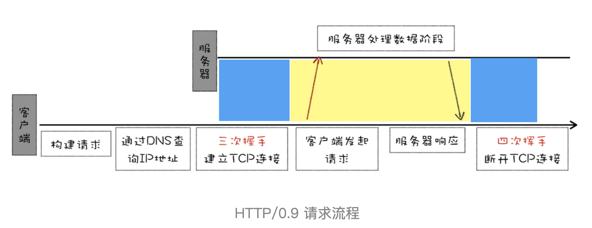
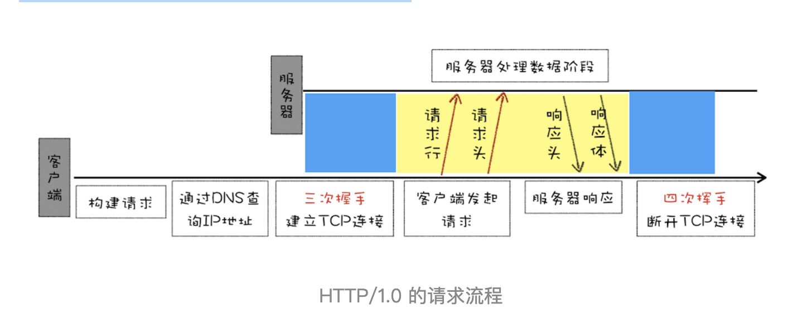
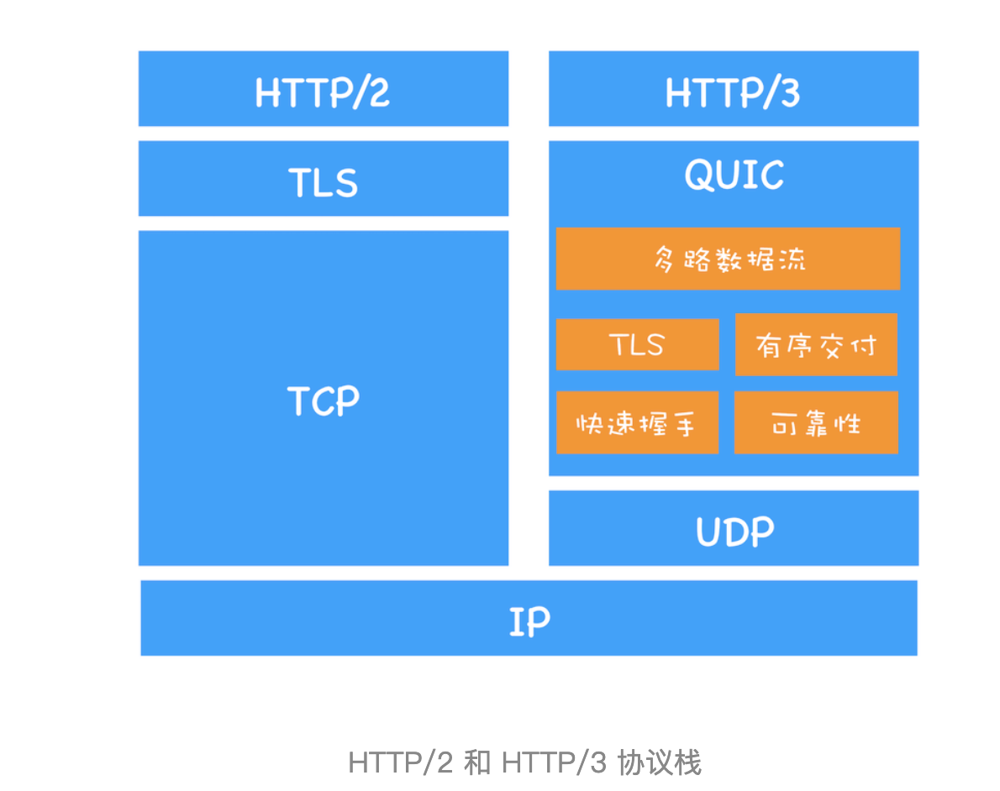

## [HTTP 文章](https://interview2.poetries.top/docs/fe-base/http-protocol/base/01-HTTP%E7%9A%84%E5%89%8D%E4%B8%96%E4%BB%8A%E7%94%9F.html)

## `HTTP/0.9？`

首先我们来看看诞生最早的 HTTP/0.9。HTTP/0.9 是于 1991 年提出的，主要用于学术交流，需求很简单——用来在网络之间传递 HTML 超文本的内容，所以被称为**超文本传输协议**。

HTTP/0.9 完整请求流程：

- 因为 HTTP 都是基于 TCP 协议的，所以客户端先要根据 IP 地址、端口和服务器建立 TCP 连接，而建立连接的过程就是 TCP 协议三次握手的过程。
- 建立好连接之后，会发送一个 GET 请求行的信息，如 GET /index.html 用来获取 index.html。
- 服务器接收请求信息之后，读取对应的 HTML 文件，并将数据以 ASCII 字符流返回给客户端。
- HTML 文档传输完成后，断开连接。

## `HTTP/1.0？`

HTTP/1.0 引入了请求头和响应头，它们都是以为 Key-Value 形式保存的，在 HTTP 发送请求时，会带上请求头信息，服务器返回数据时，会先返回响应头信息。至于 HTTP/1.0 具体的请求流程，你可以参考下图。

还有新增的几个特性：

- **状态码：** 有的请求服务器可能无法处理，或者处理出错，这时候就需要告诉浏览器服务器最终处理该请求的情况，这就引入了状态码。状态码是通过响应行的方式来通知浏览器的。

- **缓存：** 为了减轻服务器的压力，在 HTTP/1.0 中提供了 Cache 机制，用来缓存已经下载过的数据。

- **用户代理：** 服务器需要统计客户端的基础信息，比如 Windows 和 macOS 的用户数量分别是多少，所以 HTTP/1.0 的请求头中还加入了用户代理的字段

HTTP/1.0 每进行一次 HTTP 通信，都需要经历建立 TCP 连接、传输 HTTP 数据和断开 TCP 连接三个阶段。

## `HTTP/1.1？`

- 增加持久连接: 在一个 TCP 连接上可以传输多个 HTTP 请求，只要浏览器或者服务器没有明确断开连接，那么该 TCP 连接会一直保持。目前浏览器中对于同一个域名，默认允许同时建立 6 个 TCP 持久连接。

- 使用 CDN 的实现域名分片机制。

- 增加 cookie 和 安全机制。

## `HTTP/2？`

HTTP/1.1 的缺点：

1. 同一域名开启了多个 TCP 连接，那么这些连接会竞争固定的带宽。
2. 对头阻塞问题。

HTTP/2 在本质上依然是建立在 TCP 上的。

1. **一个域名只使用一个 TCP 长连接来传输数据：** 这样整个页面资源的下载过程只需要一次慢启动，同时也避免了多个 TCP 连接竞争带宽所带来的问题。

2. **利用多路复用技术解决对头阻塞问题：** 多一个二进制分帧层，可以将请求分成一帧一帧的数据去传输，并行处理，处理的请求带有 ID 编号。

3. **可以设置请求优先级：** HTTP/2 提供了请求优先级，可以在发送请求时，标上该请求的优先级，这样服务器接收到请求之后，会优先处理优先级高的请求。

4. **服务器推送：** HTTP/2 还可以直接将数据提前推送到浏览器。你可以想象这样一个场景，当用户请求一个 HTML 页面之后，服务器知道该 HTML 页面会引用几个重要的 JavaScript 文件和 CSS 文件，那么在接收到 HTML 请求之后，附带将要使用的 CSS 文件和 JavaScript 文件一并发送给浏览器，这样当浏览器解析完 HTML 文件之后，就能直接拿到需要的 CSS 文件和 JavaScript 文件，这对首次打开页面的速度起到了至关重要的作用。

5. **头部压缩：** 无论是 HTTP/1.1 还是 HTTP/2，它们都有请求头和响应头，这是浏览器和服务器的通信语言。HTTP/2 对请求头和响应头进行了压缩，你可能觉得一个 HTTP 的头文件没有多大，压不压缩可能关系不大，但你这样想一下，在浏览器发送请求的时候，基本上都是发送 HTTP 请求头，很少有请求体的发送，通常情况下页面也有 100 个左右的资源，如果将这 100 个请求头的数据压缩为原来的 20%，那么传输效率肯定能得到大幅提升。

## 什么是 HTTP？

**概念：**

> http 是一种超文本传输协议，在 OSI 模型七层中的第七层应用层，也是建立在 TCP/IP 之上。和 TCP/UDP 协议类似，实际传输数据都需要附加一些头部数据。不过与 TCP/UDP 不同的是，它是一个“纯文本”的协议，所以头数据都是 ASCII 码的文本，可以很容易地用肉眼阅读，不用借助程序解析也能够看懂。我们现在最常用的是 http1.1 版本。

**极大特性**：

- HTTP 是灵活可扩展的，可以任意添加头字段实现任意功能；
- HTTP 是可靠传输协议，基于 TCP/IP 协议“尽量”保证数据的送达；
- HTTP 是应用层协议，比 FTP、SSH 等更通用功能更多，能够传输任意数据；
- HTTP 使用了请求 - 应答模式，客户端主动发起请求，服务器被动回复请求；
- HTTP 本质上是无状态的，每个请求都是互相独立、毫无关联的，协议不要求客户端或服务器记录请求相关的信息（可以借住 cookie 达到有状态的效果）

**数据传输相关头字段：**

- 数据类型表示实体数据的内容是什么，使用的是 MIME type，相关的头字段是 Accept 和 Content-Type；
- 数据编码表示实体数据的压缩方式，相关的头字段是 Accept-Encoding 和 Content-Encoding；
- 语言类型表示实体数据的自然语言，相关的头字段是 Accept-Language 和 Content-Language；
- 字符集表示实体数据的编码方式，相关的头字段是 Accept-Charset 和 Content-Type；
- 客户端需要在请求头里使用 Accept 等头字段与服务器进行“内容协商”，要求服务器返回最合适的数据； Accept 等头字段可以用“,”顺序列出多个可能的选项，还可以用“;q=”参数来精确指定权重;

如图：

**传输大文件相关头字段：**

- **数据压缩**：浏览器在发送请求时都会带着“Accept-Encoding”头字段，里面是浏览器支持的压缩格式列表，例如 gzip、deflate、br 等(压缩文本效果好)。
- **分块传输**：在响应报文里用头字段“Transfer-Encoding: chunked”来表示，意思是报文里的 body 部分不是一次性发过来的，而是分成了许多的块（chunk）逐个发送。“Transfer-Encoding: chunked”和“Content-Length”这两个字段是互斥的，也就是说响应报文里这两个字段不能同时出现，一个响应报文的传输要么是长度已知，要么是长度未知（chunked），这一点你一定要记住。
- **范围请求**：想拖动进度条快进几分钟，这实际上是想获取一个大文件其中的片段数据，而分块传输并没有这个能力。服务器必须在响应头里使用字段“Accept-Ranges: bytes”明确告知客户端：“我是支持范围请求的”。

> 总结：

- 压缩 HTML 等文本文件是传输大文件最基本的方法；
- 分块传输可以流式收发数据，节约内存和带宽，使用响应头字段“Transfer-Encoding: chunked”来表示，分块的格式是 16 进制长度头 + 数据块；
- 范围请求可以只获取部分数据，即“分块请求”，实现视频拖拽或者断点续传，使用请求头字段“Range”和响应头字段“Content-Range”，响应状态码必须是 206；
- 也可以一次请求多个范围，这时候响应报文的数据类型是“multipart/byteranges”，body 里的多个部分会用 boundary 字符串分隔；

**http 连接管理相关：**

- **短连接**：http1.1 之前都是短连接，它底层的数据传输基于 TCP/IP，每次发送请求前需要先与服务器建立连接，收到响应报文后会立即关闭连接。频繁的打开和关闭链接服务器压力很大。
- **长链接**：在第一次请求建立链接后，不关闭。HTTP/1.1 中的连接都会默认启用长连接。不需要用什么特殊的头字段指定，只要向服务器发送了第一次请求，后续的请求都会重复利用第一次打开的 TCP 连接，也就是长连接，在这个连接上收发数据。如果服务器支持长连接，它总会在响应报文里放一个“Connection: keep-alive”字段。

- **队头阻塞问题：**
  “队头阻塞”与短连接和长连接无关，而是由 HTTP 基本的“请求 - 应答”模型所导致的。因为 HTTP 规定报文必须是“一发一收”，这就形成了一个先进先出的“串行”队列。队列里的请求没有轻重缓急的优先级，只有入队的先后顺序，排在最前面的请求被最优先处理。

> 总结：

- 早期的 HTTP 协议使用短连接，收到响应后就立即关闭连接，效率很低；
- HTTP/1.1 默认启用长连接，在一个连接上收发多个请求响应，提高了传输效率；
- 服务器会发送“Connection: keep-alive”字段表示启用了长连接；
- 报文头里如果有“Connection: close”就意味着长连接即将关闭；
- 过多的长连接会占用服务器资源，所以服务器会用一些策略有选择地关闭长连接；
- “队头阻塞”问题会导致性能下降，可以用“并发连接”和“域名分片”技术缓解

## HTTP2 以及特性？

**概念：**

> http2 是 http1.1 的下一个版本。http2 对之前版本做了功能上的兼容，由于 HTTPS 已经在安全方面做的非常好了，所以 HTTP/2 的唯一目标就是改进性能。特别要说的是，与 HTTPS 不同，HTTP/2 没有在 URI 里引入新的协议名，仍然用“http”表示明文协议，用“https”表示加密协议。

**兼容 HTTP：**

> 因为必须要保持功能上的兼容，所以 HTTP/2 把 HTTP 分解成了“语义”和“语法”两个部分，“语义”层不做改动，与 HTTP/1 完全一致（即 RFC7231）。比如请求方法、URI、状态码、头字段等概念都保留不变，这样就消除了再学习的成本，基于 HTTP 的上层应用也不需要做任何修改，可以无缝转换到 HTTP/2。

[HTTP2 特性文章](https://blog.csdn.net/qq_36885515/article/details/123137845)

**几大特性：**

1. **头部压缩**：HTTP/2 头部通过 HPACK 算法进行压缩，这种算法通过服务端和客户端各自维护索引表来实现。索引表又分为静态表和动态表。客户端通过传输索引号（不需要在传输），服务端根据索引号在动态表中获取 Header 的 key 与 value，，极大减少了报文大小。静态表中的字段和值固定，而且是只读的。

2. **二进制分帧**：http2 采用二进制格式传输数据，而非 HTTP 1.x 的文本格式，二进制协议解析起来更高效。HTTP / 1 的请求和响应报文，都是由起始行，首部和实体正文（可选）组成，各部分之间以文本换行符分隔。HTTP/2 将请求和响应数据分割为更小的帧，并且它们采用二进制编码。HTTP/2 中，同域名下所有通信都在单个连接上完成，该连接可以承载任意数量的双向数据流。每个数据流都以消息的形式发送，而消息又由一个或多个帧组成。多个帧之间可以乱序发送，根据帧首部的流标识可以重新组装。

- **流**：流是连接中的一个虚拟信道，可以承载双向的消息；每个流都有一个唯一的整数标识符（1、2…N）；

- **消息**：是指逻辑上的 HTTP 消息，比如请求、响应等，由一或多个帧组成。

- **帧**：HTTP 2.0 通信的最小单位，每个帧包含帧首部，至少也会标识出当前帧所属的流，承载着特定类型的数据，如 HTTP 首部、负荷，等等

HTTP/2 引入的二进制数据帧和流的概念，其中帧对数据进行顺序标识，这样浏览器收到数据之后，就可以按照序列对数据进行合并，而不会出现合并后数据错乱的情况。同样是因为有了序列，服务器就可以并行的传输数据，这就是流所做的事情。
我们说的 **多路复用** 进行链连接管理，性能极大提升。

- 同域名下所有通信都在单个连接上完成
- 单个连接可以承载任意数量的双向数据流
- 数据流以消息的形式发送，而消息又由一个或多个帧组成，多个帧之间可以乱序发送，因为根据帧首部的流标识可以重新组装。

多路复用 如图：

3. **服务器推送（server push）**：在一定程度上改变了传统的“请求 - 应答”工作模式，服务器不再是完全被动地响应请求，也可以新建“流”主动向客户端发送消息。比如，在浏览器刚请求 HTML 的时候就提前把可能会用到的 JS、CSS 文件发给客户端，减少等待的延迟，这被称为“服务器推送”（Server Push，也叫 Cache Push）。
   

> 安全方面：http2 虽然表面上是明文传递，但事实上 http2 是加密的。互联网上通常所能见到的 HTTP/2 都是使用“https”协议名，跑在 TLS 上面（要求下层的通信协议必须是 TLS1.2 以上）。为了区分“加密”和“明文”这两个不同的版本，HTTP/2 协议定义了两个字符串标识符：“h2”表示加密的 HTTP/2，“h2c”表示明文的 HTTP/2，多出的那个字母“c”的意思是“clear text”。

> 3 种协议结构图
> 

> http2 总结：

- HTTP 协议取消了小版本号，所以 HTTP/2 的正式名字不是 2.0；
- HTTP/2 在“语义”上兼容 HTTP/1，保留了请求方法、URI 等传统概念；
- HTTP/2 使用“HPACK”算法压缩头部信息，消除冗余数据节约带宽；
- HTTP/2 的消息不再是“Header+Body”的形式，而是分散为多个二进制“帧”；
- HTTP/2 使用虚拟的“流”传输消息，解决了困扰多年的“队头阻塞”问题，同时实现了“多路复用”，提高连接的利用率；
- HTTP/2 也增强了安全性，要求至少是 TLS1.2，而且禁用了很多不安全的密码套件

## HTTP/1.x keep-alive 与 HTTP/2 多路复用区别？

- HTTP/1.x 是基于文本的，只能整体去传;HTTP/2 是基于二进制流的，可以分解为独立的帧，交错发送

- HTTP/1.x keep-alive 必须按照请求发送的顺序返回响应;HTTP/2 多路复用不按序响应

- HTTP/1.x keep-alive 为了解决队头阻塞，将同一个页面的资源分散到不同域名下，开启了多个 TCP 连接;HTTP/2 同域名下所有通信都在单个连接上完成

- HTTP/1.x keep-alive 单个 TCP 连接在同一时刻只能处理一个请求(两个请求的生命周期不能重叠);HTTP/2 单个 TCP 同一时刻可以发送多个请求和响应

---

## 简单讲解一下 http2 的多路复用

在 HTTP/1 中，每次请求都会建立一次 HTTP 连接，也就是我们常说的 3 次握手 4 次挥手，这个过程在一次请求过程中占用了相当长的时间，即使开启了 Keep-Alive ，解决了多次连接的问题，但是依然有两个效率上的问题：

- 第一个：串行的文件传输。当请求 a 文件时，b 文件只能等待，等待 a 连接到服务器、服务器处理文件、服务器返回文件，这三个步骤。我们假设这三步用时都是 1 秒，那么 a 文件用时为 3 秒，b 文件传输完成用时为 6 秒，依此类推。（注：此项计算有一个前提条件，就是浏览器和服务器是单通道传输）

- 第二个：连接数过多。我们假设 Apache 设置了最大并发数为 300，因为浏览器限制，浏览器发起的最大请求数为 6，也就是服务器能承载的最高并发为 50，当第 51 个人访问时，就需要等待前面某个请求处理完成。

HTTP/2 的多路复用就是为了解决上述的两个性能问题。 在 HTTP/2 中，有两个非常重要的概念，分别是帧（frame）和流（stream）。 帧代表着最小的数据单位，每个帧会标识出该帧属于哪个流，流也就是多个帧组成的数据流。 多路复用，就是在一个 TCP 连接中可以存在多条流。换句话说，也就是可以发送多个请求，对端可以通过帧中的标识知道属于哪个请求。通过这个技术，可以避免 HTTP 旧版本中的队头阻塞问题，极大的提高传输性能。

## `HTTP3：甩掉TCP、TCL包袱，构建高效网络`

### TCP 对头阻塞问题

虽然 HTTP/2 解决了应用层面的队头阻塞问题，不过和 HTTP/1.1 一样，HTTP/2 依然是基于 TCP 协议的，依然存在 TCP 对头阻塞问题。

> 由于单个数据包的丢失而造成的阻塞称为 TCP 上的队头阻塞

随着丢包率的增加，HTTP/2 的传输效率也会越来越差。有测试数据表明，当系统达到了 2% 的丢包率时，HTTP/1.1 的传输效率反而比 HTTP/2 表现得更好。

### QUIC 协议

1. 修改 TCP 协议本身难度大（中间设备兼容）。
2. 开发新的协议（TCP、UDP 以外的）难度大（中间设备兼容）。

<b>QUIC 协议</b>最终是基于 UDP 协议开发的类似于 TCP 的多路数据流、传输可靠性等功能。

## HTTPS（让数据传输更安全）？

## HTTP 的报文结构（请求报文和响应报文）？

- 起始行（请求行/状态行）：描述请求或响应的基本信息；
- 头部字段（请求报头/响应报头）：描述一些详细的报文信息；
- 消息正文（请求正文/响应正文）：实际传输的数据，它不一定是纯文本，可以是图片、视频等二进制数据；

前两部分起始行和头部字段经常又合称为“请求头”或“响应头”，消息正文又称为“实体”
HTTP 协议规定报文必须有 header，但可以没有 body，而且在 header 之后必须要有一个“空行”，也就是“CRLF”，十六进制的“0D0A”。
整体结构如图：

请求行由三部分构成：

- 请求方法：是一个动词，如 GET/POST，表示对资源的操作；
- 请求目标：通常是一个 URI，标记了请求方法要操作的资源；
- 版本号：表示报文使用的 HTTP 协议版本；

状态行也是由三部分构成：

- 版本号：表示报文使用的 HTTP 协议版本；
- 状态码：一个三位数，用代码的形式表示处理的结果，比如 200 是成功，500 是服务器错误；
- 原因：作为数字状态码补充，是更详细的解释文字，帮助人理解原因；

头部字段（请求头和响应头）：
头部字段是 key-value 的形式，key 和 value 之间用“:”分隔。

> HTTP 头字段非常灵活，不仅可以使用标准里的 Host、Connection 等已有头，也可以任意添加自定义头，这就给 HTTP 协议带来了无限的扩展可能。

## HTTP 的 URI 结构？

**概念**： 是用来唯一标记服务器上资源的一个字符串，通常也称为 URL；通常由 scheme、host:port、path 和 query 四个部分组成，有的可以省略；

## HTTP 的请求方式、区别？

## 常见的 HTTP 状态吗？301 和 302 的区别？

## 常见的 HTTP 请求头？

## TCP 的三次握手？

1. 客户端发送 SYN seq=0，状态变为 SYN_SENT
2. 服务端发送 SYN seq=0 ack=1，状态变为 SYN_RCVD
3. 客户端发送 seq=1 ack=1，两端状态都变成已建立连接状态

## 为什么 http 建立连接需要三次握手，不是两次或四次?

三次是最少的安全次数，两次不安全，四次浪费资源；

## 四次挥手？

1. 客户端发送 FIN seq=0 ack=0，状态变为 FIN_WAIT_1
2. 服务端发送 ack=1，状态变为 CLOSE_WAIT，客户端状态变为 FIN_WAIT_2（只收不发）
3. 服务端发送 FIN seq=1，状态变为 LAST_ACK，客户端变为 TIME_WAIT
4. 客户端发送 ack=2，服务端状态变为 CLOSE

## 为什么要四次挥手？

那是因为握手的时候并没有数据传输，所以服务端的 SYN 和 ACK 报文可以一起发送，但是挥手的时候有数据在传输，所以 ACK 和 FIN 报文不能同时发送，需要分两步，所以会比握手多一步。

## TCP 和 UDP 的区别？

TCP 面向连接（如打电话要先拨号建立连接）提供可靠的服务，UDP 是无连接的，即发送数据之前不需要建立连接，UDP 尽最大努力交付，即不保证可靠交付。

## fetch 发送 2 次请求的原因？

当使用 fetch 发送 POST 请求时，会先发送一个 OPTION 请求进行预检查，用来获知服务端是否允许该跨域请求，服务器确认允许之后会返回 204 状态码，表示允许该跨域请求，这时才发起实际的 HTTP 请求。在预检请求的返回中，服务器端也可以通知客户端，是否需要携带身份凭证（包括 Cookies 和 HTTP 认证相关数据）

## Cookie，sessionStorage，localStorage 的区别？session？是否可以跨域获取缓存

## Cookie 如何防范 XSS 攻击？

## HTTPS？

**对称加密**:  
就是指加密和解密时使用的密钥都是同一个，是“对称”的。只要保证了密钥的安全，那整个通信过程就可以说具有了机密性。  
**非对称加密**：

1、CDN 是什么？
CDN 位于浏览器和服务器之间，主要起到缓存加速的作用；

1、介绍 Http2，优点和存在什么坑或问题（必考）
2、HTTP 报文的请求和返回会有几个部分（请求行、请求头、请求体）；每部分具体都有什么（常见的请求头）
3、GET 和 POST 的区别
4、输入 url 到页面加载全过程（必考）
5、介绍 HTTPS；HTTP 和 HTTPS 的区别（必考）
6、HTTPS 加密过程
7、HTTP 缓存控制（强缓存、弱缓存）；缓存相关的 HTTP 请求头（必考）
8、对跨域的了解，跨域怎么解决（必考）
9、cors 的返回头、cors 预请求，什么时候会出发预请求（必考）
10、tcp 的长连接和 http2 多路复用相关
11、tcp 拥塞控制和流量控制
12、三次握手四次挥手，为什么三次和四次

## 面试要看的

https://juejin.cn/post/6948576107163549732?utm_source=gold_browser_extension
