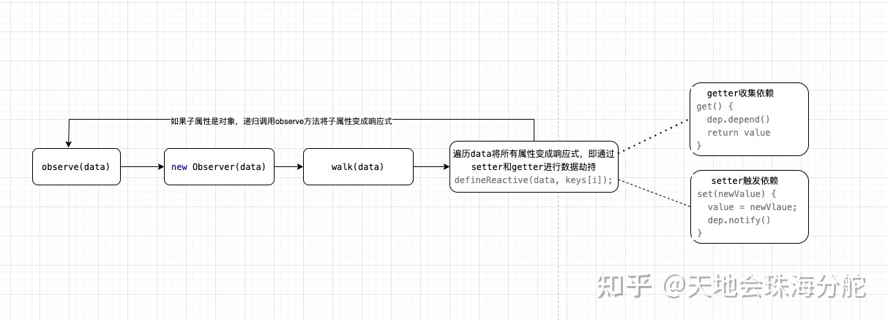

<style>
  /* body { background-color: #000 !important; } */
  /* h1,h2,h3,h4,h5,h6,h7,p { color: #999 !important; } */
  /* h3 {
    display: inline-flex;
    align-items: center;
    font-weight: 700;
    color: #fff;
    background: linear-gradient(#fff 50%,#fc625d 80%);
    padding: 3px 10px 4px;
    border-top-right-radius: 3px;
    border-top-left-radius: 3px;
    margin-right: 3px;
    font-size: 20px;
    margin-top: -1.1rem !important;
  } */
  h3 {
    font-size: 20px;
  }
  h3:before {
    content: "";
    border-bottom: 2px solid #ef7060;
    width: 100%;
    display: block;
    height: 10px;
    position: absolute;
    margin-top: 21px;
  }
  b {
    color: red;
  }
</style>

## 基础篇

[Vue 经典面试题源码级详解](https://juejin.cn/post/7097067108663558151)

https://juejin.cn/post/7137294579346178084

---

vue2.7 更新都做了什么？
[Vue2 彻底从 Flow 重构为 TypeScript](https://blog.51cto.com/u_15490526/5288715)

---

## `Q：MVC、MVP、MVVM？`

- `MVC：` 前端的 MVC 与后端类似，具备着 View、Controller 和 Model。

  - `Model：`负责保存应用数据，与后端数据进行同步。

  - `Controller：`负责业务逻辑，根据用户行为对 Model 数据进行修改。

  - `View：`负责视图展示，将 Model 中的数据可视化出来。

> 早期的`backbone.js`框架就是这种`MVC`的模式。

- `MVP：` MVP 与 MVC 很接近，P 指的是`Presenter`，presenter 可以理解为一个中间人，它负责着 View 和 Model 之 间的数据流动，防止 View 和 Model 之间直接交流。

> 前端很少涉及`MVP`架构，一般安卓等原生开发中常见。

- `MVVM：` MVVM 可以分解成(`Model-View-VIewModel`)。ViewModel 可以理解为在 presenter 基础上的进阶版

  - `Model：`模型层（数据层），主要用于保存一些数据

  - `View：` 视图层，主要用于将后端数据借助各种元素呈现给用户，同时也可提供用户操作的入口

  - `ViewModel：`视图模型层：该层也是 mvvm 中的核心层，主要用于作为 Model 个 View 两个层的数据连接层，负责两个层之间的数据传递。该层主要包含两大功能点：

    - `DOM监听`（DOM Listener） 用于监听 dom 元素的一些事件，如果 dom 元素发生变化在需要的时候会改变对应的 data

    - `数据绑定`（Data bindings）用于将 model 的改变反应在 view 上及时呈现给用户

ViewModel 通过双向数据绑定把 View 层和 Model 层连接了起来，而 View 和 Model 之间的同步工作是由 Vue.js 完成的，我们不需要手动操作 DOM，只需要维护好数据状态。

---

## `Q：什么是Vue？`

Vue 是一款用于构建用户界面的 JavaScript 框架。它基于标准 HTML、CSS 和 JavaScript 构建，并提供了一套声明式的、组件化的编程模型。

- `声明式渲染：`Vue 基于标准 HTML 拓展了一套模板语法，使得我们可以声明式地描述最终输出的 HTML 和 JavaScript 状态之间的关系。

- `响应式：` Vue 会自动跟踪 JavaScript 状态变化并在改变发生时响应式地更新 DOM。

- `渐进式框架：` Vue 是一个框架，也是一个生态。

  - 无需构建步骤，渐进式增强静态的 HTML
  - 在任何页面中作为 Web Components 嵌入
  - 单页应用 (SPA)
  - 全栈 / 服务端渲染 (SSR)
  - Jamstack / 静态站点生成 (SSG)
  - 开发桌面端、移动端、WebGL，甚至是命令行终端中的界面

- `单文件组件：` 在大多数启用了构建工具的 Vue 项目中，我们可以使用一种类似 HTML 格式的文件来书写 Vue 组件，它被称为单文件组件 (也被称为 \*.vue 文件，英文 Single-File Components，缩写为 SFC)。

- `选项式API/组合式API`

---

## `Q：谈谈你对SPA单页面的理解？`

<b>SPA（ single-page application ）</b>仅在 Web 页面初始化时加载相应的 HTML、JavaScript 和 CSS。一旦页面加载完成，SPA 不会因为用户的操作而进行页面的重新加载或跳转；取而代之的是利用路由机制实现 HTML 内容的变换，UI 与用户的交互，避免页面的重新加载。

**优点：**

- 用户体验好、快，内容的改变不需要重新加载整个页面，避免了不必要的跳转和重复渲染；
- 基于上面一点，SPA 相对对服务器压力小；
- 前后端职责分离，架构清晰，前端进行交互逻辑，后端负责数据处理

**缺点：**

- 初次加载耗时多：为实现单页 Web 应用功能及显示效果，需要在加载页面的时候将 JavaScript、CSS 统一加载，部分页面按需加载；
- 前进后退路由管理：由于单页应用在一个页面中显示所有的内容，所以不能使用浏览器的前进后退功能，所有的页面切换需要自己建立堆栈管理；
- SEO 难度较大：由于所有的内容都在一个页面中动态替换显示，所以在 SEO 上其有着天然的弱势

## `Q：Vue组件之间通信方式有哪些？`

- `父子组件`：props/$emit/$parent/ref/$attrs

- `兄弟组件`：$parent/$root/eventbus/vuex

- `跨层级关系`：eventbus/vuex/provide+inject

- `自己的功能组件库通信`: 自行实现派发(dispatch)与广播(broadcast)方法。

- `更强大的找到任意组件实例`: findComponents
  - 由一个组件，向上找到最近的指定组件；
  - 由一个组件，向上找到所有的指定组件；
  - 由一个组件，向下找到最近的指定组件；
  - 由一个组件，向下找到所有指定的组件；
  - 由一个组件，找到指定组件的兄弟组件。

---

## `Q：v-for和v-if哪个优先级高，能一起使用吗？`

首先不要在同一个元素或者组件上一起使用 v-for 和 v-if。
解决方式：如下

1. 在渲染一个列表过滤条件的时候可以使用计算属性来实现。
2. 在判断是否要隐藏渲染列表的时候，可以包裹一层 template。

在`vue2`中，如果同时使用 v-for 会优先于 v-if，不管渲染列表有多少，都会全部渲染完之后在进行判断，有损性能。在`vue3`中却完全相反，所以先 if 判断的时候变量还不存在会`报错`。

---

## `Q：Vue生命周期图谱（8个钩子版本）？`


**---------------创建阶段--------------**

- `beforeCreate`：在这个阶段，做了一些选项的合并优化，初始化组件实例的关系属性，比如 $parent、$children、$root、$refs 等，初始化了自定义事件等。注意：这时候 data 和 method 等中的数据还没有初始化。通常用于插件开发中执行一些初始化任务。
- `created`： 在这个阶段，初始化 provide/inject 等，初始化 props、data、methods、computed、watch 等并且对其做代理以及响应式处理。如果要调用 methods 中的方法或者 data 中的数据，最早只能在`created`中操作。
- `beforeMount`：在这个阶段是 组件挂载之前。（完成了 data 和 el 数据初始化），模板已经在内存中编译好了，但未挂载到页面中。在这里可以在渲染前最后一次更改数据的机会，不会触发其他的钩子函数，一般可以在这里做初始数据的获取。
- `mounted`： 在这个阶段，把已经编译好的模板替换到页面中。最早可以在`mounted`中操作 dom。执行完了 mounted, 表示整个 vue 实例完全初始化完毕。此时脱离了创建阶段，开始了运行阶段。

**---------------运行阶段--------------**

- `beforeUpdate`：从 data 数据改变到视图更新之前。
- `update`：data 数据已经完全同步到视图。

**---------------销毁阶段--------------**

- `beforeDestroy（beforeUnmount）`：组件实例销毁之前，这时候组件实例的 data、methods 等还可以使用，一般在这里处理一些销毁之前做的事情，比如取消定时器等。
- `destroy（unmounted）`：此时组件实例已经完全销毁，组件中所有的数据等都不可以使用了。

---

## `Q: 衍生：vue父子生命周期全流程？`

父子组件的生命周期是一个嵌套的过程。

- 渲染挂载过程：
  - `父beforeCreate`->`父created`->`父beforeMount`->`子beforeCreate`->`子created`->`子beforeMount`->`子mounted`->`父mounted`
- 子组件更新过程：
  - `父beforeUpdate`->`子beforeUpdate`->`子updated`->`父updated`
- 父组件更新过程：
  - `父beforeUpdate`->`父updated`
- 销毁过程：
  - `父beforeDestroy`->`子beforeDestroy`->`子destroyed`->`父destroyed`

---

## `Q: Vue初始化过程/原理（new Vue()）？`

- <b>合并选项和规范化</b>
  - 处理组件配置项
  - 初始化根组件时进行了选项合并操作，将全局配置合并到根组件的局部配置上
  - 初始化每个子组件时做了一些性能优化，将组件配置对象上的一些深层次属性放到 vm.$options 选项中，以提高代码的执行效率
- <b>初始化组件实例的关系属性：</b>`比如 $parent、$children、$root、$refs 等
- <b>处理自定义事件`</b>
- <b>调用 `beforeCreate` 钩子函数</b>
- <b>初始化组件的 `inject` 配置项</b>，得到 ret[key] = val 形式的配置对象，然后对该配置对象进行浅层的响应式处理（只处理了对象第一层数据），并代理每个 key 到 vm 实例上
- <b>数据响应式，处理</b> props、methods、data、computed、watch 等选项
- <b>解析组件配置项上的 `provide` 对象</b>，将其挂载到 vm.\_provided 属性上
- <b>调用 `created` 钩子函数</b>
- 如果发现配置项上有 el 选项，则自动调用 `$mount` 方法，也就是说有了 el 选项，就不需要再手动调用 $mount 方法，反之，没提供 el 选项则必须调用` $mount`
- <b>接下来则进入`挂载阶段`</b>

---

## ` Q：Vue响应式原理？`

回答范例：
**所谓响应式就是：** 能够使数据变化可以被检测并对这种变化做出响应的机制。

https://www.cnblogs.com/zhilili/p/14734468.html

有几个核心类 Obsever、Dep、Watcher、Scheduler
最后核心就是通过 ES5 提供的属性访问器`Object.defineProperty()`来做到的。

1. 在 vue 实例初始化过程中会创建 Observer 实例，Observer 把对象得到每个属性通过`Object.defineProperty`进行拦截（这个流程会递归处理），如果后续要新增属性或者删除的话，使用实例的`$set`和`$delete`来实现，否则无法达到响应式。如果数据是数组的话，会覆盖数组的 7 个改变原数组的方法从而达到数组的响应式处理。总之，Observer 的目标，就是要让一个对象，它的属性的读取、赋值，内部数组的变化都要能够被 vue 检测到，这样才能让数据转换为响应式数据。


2. 会给每个属性创建一个 dep 实例，当读取响应式对象的某个属性时，它会进行依赖收集，当改变某个属性时，它会派发更新。
   

3. 那 dep 本身是不知道谁在用我，或者我该通知谁。watcher 通过设置全局变量的方式读取数据，因为读取了数据，所以会触发响应式对象的 getter，随后 getter 会从全局变量的位置读取到当前正在读取的 watcher 并把 watcher 收集到 Dep 中。其中 wacher 中就会有我们的渲染 render 函数。

4. 之后我们修改数据，会进行派发更新，通知 watcher，但不会立即执行，因为数据变动有时候不是一个，而是很多，立即执行的话会重复执行很多 render 函数或者其它数据变动的函数，执行效率会变低。然而 watcher 把自己交给调度器 Scheduler

5. 调度器会把 watcher 添加到队列中，当然在队列中也不会执行的，而是将队列交给 nextTick 队列，nextTick 里面的函数全是在微队列的，等同步代码执行完成后，会异步地执行函数 fn1、fn2、watcher 等等，这一步相当于重新执行了 watcher，然后又重新执行了 render 函数，就这样地循环往复。

总体流程图:


---

## `Q：什么是前端响应式？（（响应式细节问题））`

所谓<b>响应式(Reactive)</b>，放在一个前端框架中，指的就是框架能够主动<b>观察(Observe)状态</b>数据的变化(即 Vue 中的 data)，并收集所有<b>依赖(Depend)</b>该数据的<b>监控(Watch)</b>回调代码，在数据发生改动时，主动执行该监控回调以更新目标数据或者更新视图。例如 Vue 中会由以下三个主要类来实现：

- <b>Observer:</b> 观察者，主要的作用是结合 observe 辅助方法，通过 javascript 原生的 defineProperty 方法，为目标数据对象的每个属性添加一个 getter 和 setter，以实现依赖的收集和数据的劫持。其中 getter 的目的主要是为了收集依赖，某处代码如果有引用该数据对应子属性，则会自动触发 getter，此时即可以进行依赖的收集；而 setter 主要是为了实现数据的劫持，在该数据被修改时，相应的 setter 将会触发，此时将会通知相应的依赖项进行执行。
- <b>Dep:</b> 依赖，主要的作用是通过观察者模式，将所有持有对应数据依赖回调的监控对象(Watcher)给保存起来到一个数组中，当依赖数据发生改变时，通知对应的监控对象来执行相应的依赖回调。
- <b>Watcher：</b>监控者，持有依赖目标数据的监控回调。当对应的依赖数据发生变化时，将触发该 watcher 对应的依赖回调以实现响应式。

## `Q：什么是数据劫持，Vue是如何做？（响应式细节问题）`

要实现响应式，我们首先需要做的就是要截获数据的访问和修改，也就是所谓的<b>数据劫持</b>。

简单的实现数据劫持：

```js
function defineReactive(data, key, val = data[key]) {
  Object.defineProperty(data, key, {
    // getter
    get() {
      ...// 数据访问劫持，在返回数据之前先做些依赖收集相关的事情
      return val;
    },
    // setter
    set(newVal) {
      val = newVal;
      ... // 劫持修改，在修改数据之后通知依赖count的所有watcher进行数据更新
    },
  });
}

const data = {};
defineReactive(data, "count", 0);
```

**Observer 实现劫持对象每个嵌套属性**

通过 defineReactive，我们可以很方便的指定对象及对象的某个属性来对其实现数据劫持，但是这里每个属性都需要调用一遍的话太过于麻烦，所以我们希望通过进一步的封装，只提供一个对象作为参数，即可对其下的所有属性自动实现数据劫持。

这里就是我们引入 Observer 这个类的地方

```js
export class Observer {
  constructor (value) {
      ...
      def(value, '__ob__', this)
      this.walk(value)
  }

  walk (obj) {
    const keys = Object.keys(obj)
    for (let i = 0; i < keys.length; i++) {
      defineReactive(obj, keys[i])
    }
  }
}
```

同时，为了方便调用，vue 框架还实现一个叫做 observe 的辅助函数。

```js
function observe(value) {
  if (!isObject(value)) {
    return;
  }
  var ob;
  if (hasOwn(value, "__ob__") && value.__ob__ instanceof Observer) {
    ob = value.__ob__;
  } else {
    ob = new Observer(value);
  }
  return ob;
}
```

vue 的做法是将递归放入到了 defineReactive 方法中，因为考虑到 defineReactive 今后还需要用到该子属性对应的 Observer 实例对象。因此，此时 defineReactive 的代码大致如下:

```js
function defineReactive(data, key, val = data[key]) {
  let childOb = observe(val)
  Object.defineProperty(data, "count", {
    // getter
    get() {
      ...// 数据访问劫持，在返回数据之前先做些依赖收集相关的事情
      return val;
    },
    // setter
    set(newVal) {
      val = newVal;
      ... // 劫持修改，在修改数据之后通知依赖count的所有watcher进行数据更新
    },
  });
}
```

整个数据劫持的流程图：


- **observe(data)** 拉开了对 value 对象实现数据劫持的序幕，方法内部的 new Observer(data)就是这一切的始点。
- 跟着 Observer 构造函数开始调用**walk 方法**来遍历 data 对象的下一层子属性，比如 count 子属性，并为每个子属性 defineReactive 方法以实现该属性的数据劫持
- 在**defineReactive**开始时，会先针对该子属性执行一次**observe**，如果 observe 方法发现该子属性是个对象，也就是该子属性还有子属性，则会跳到这里的第一点开始以子属性作为新的 data(比如上面的 data 下的 count 属性)，开始递归
- 递归完成后，继续上一层子属性的数据劫持操作
- 最终实现对目标对象的所有层级嵌套属性的数据劫持

## `Q：如何防止对某个属性重复进行劫持？（响应式相关细节问题）`

如果目标对象(或者递归中的子属性)已经被劫持，即已经有<b>\_\_ob\_\_</b>属性，则直接返回该保存的 Observer 实例对象。如果没有被劫持，则调用 Observer 构造函数触发 walk 成员方法来对下一层属性进行数据劫持。

核心代码：

```js
function observe(value) {
  if (!isObject(value)) {
    return;
  }
  var ob;
  if (hasOwn(value, "__ob__") && value.__ob__ instanceof Observer) {
    ob = value.__ob__;
  } else {
    ob = new Observer(value);
  }
  return ob;
}
```

## `Q：什么是依赖收集？（响应式细节问题）`

所谓依赖收集，指的就是将依赖某个属性的代码给保存起来，以便在今后截获到对这个属性的修改时，将触发所有依赖这个属性的依赖回调代码。

## `Q：Vue怎么实现依赖收集的？（响应式细节问题）`

Vue 使用 Dep 类来实现依赖收集，实现<b>订阅(addSub)和通知(notify)</b>。这听上去就是个很典型的发布订阅/观察者模式的应用场景。

```js
class Dep {
  constructor() {
    this.subs = [];
  }
  addSub(依赖回调) {
    this.subs.push(依赖回调);
  }
  notify() {
    this.subs.forEach((依赖回调) => 依赖回调());
  }
}
```

只是在 vue 中，我们不是直接将依赖回调给保存到 subs 数组中，而是先将依赖回调保存到 Watcher 实例中，然后将该实例保存到 subs 数组中。

所以这里的 Watcher 应该持有以下一些基本数据，从而将目标对象所依赖的属性和依赖回调给关联起来：

- 目标对象。比如 data，但因为 vue 中实现了数据代理，所以 data 中的数据同样也会直接出现在 vm 中，所以下面的代码可以直接用 vm 代替 data。
- 依赖属性的访问路径。比如依赖的是 data 下面的 count.totoal，那么访问路径就是'count.total'
- 依赖回调

如此一来，Watcher 类大概可以实现成下面这个样子

```js
class Watcher {
  constructor(vm, expr, cb) {
    // vm，因为实现了数据代理，所以相当于data；expr，即访问路径，如'count.total';cb: 依赖回调
    this.vm = vm;
    this.expr = expr;
    this.cb = cb;
  }
  update() {
    //todo: 调用依赖回调cb
  }
}
```

上边的 Dep 类改成：

```js
class Dep {
  constructor() {
    this.subs = [];
  }
  addSub(watcher) {
    this.subs.push(watcher);
  }
  notify() {
    this.subs.forEach((watcher) => watcher.update());
  }
}
```

在 vue 中，依赖收集阶段其实并不是直接通过调用 addSub 来把 watcher 加入到 subs 中的，而是通过增加一个叫做 depend 的方法

```js
class Dep {
  constructor() {
    this.subs = [];
  }
  depend() {
    this.addSub(Dep.target);
  }
  addSub(sub) {
    this.subs.push(sub);
  }
  notify() {
    this.subs.forEach((watcher) => watcher.update());
  }
}
```

而该 depend 的方法在哪里调用呢？就在 defineReactive 的 getter 中，因为谁引用了该属性，谁就依赖了该属性。

所以 defineReactive 方法稍微修改下 getter，为每个属性添加一个 dep 对象，用来存储所有依赖这个属性的 watcher。同时，在 getter 中开始触发依赖的收集。

```js
function defineReactive(data, key, val = data[key]) {
  const dep = new Dep()
  let childOb = observe(val)
  Object.defineProperty(data, key, {
    // getter
    get() {
      if (Dep.target) {
        dep.depend()
      }
      return val
    },
    // setter
    set(newVal) {
      val = newVal;
      ... // 劫持修改，在修改数据之后通知依赖count的所有watcher进行数据更新
    },
  });
}
```

那么上面 Dep 中 depend 方法以及这里 getter 中用到的 Dep.target 究竟是什么呢？事实上，它就是一个全局的 Watcher 实例，这主要会在 Watcher 这个类中进行设置。

在 Watcher 类的构造函数中，会调用成员方法 get 来访问所依赖的属性，从而引发该属性的 getter 执行。

```js
class Watcher {
  constructor(vm, expr, cb) {
    // vm，因为实现了数据代理，所以相当于data；expr，即访问路径，如'count.total';cb: 依赖回调
    this.vm = vm;
    this.expr = expr;
    this.cb = cb;
    this.value = this.get(); // 访问目标属性以触发getter从而发起依赖收集流程
  }
  update() {
    //todo: 调用依赖回调cb
  }
  get() {
    Dep.target = this;
    const value = 读取vm中的expr路径的属性; // 从而触发对应属性的getter
    Dep.target = null;
    return value;
  }
}
```

因为上面代码在访问依赖属性之前先把 Dep.target 设置成当前的 watcher 实例本身，所以 defineReactive 的 getter 中就会认为当前正处于依赖收集阶段，所以就会继续调用 dep.depend 方法，从而将该 watcher 实例加入到该属性的 dep 实例所维护的 subs 数组中。

完了后上面的代码会继续走，将 Dep.target 设置成 null，从而结束依赖收集阶段。

也就是说，只有 Watcher 中的 get 方法会触发 getter 中的 dep.depend，即只有在 new Watcher(vm, key,...) 会引发依赖收集。

```js
const data = {
  count: { total: 100 }
}
new Watcher(vm, 'count.total, () => {console.log('total 发生改变'})
```

而一般的数据访问则不会进行依赖收集，比如下面 vue 组件 methods 配置项中的代码：

```js
methods: {
  getPrice() {
    const price = this.data.count.total * 10
  }
}
```

这段代码虽然有访问 data 下 count.total 属性，但是因为没有设置 Dep.target，所以在 defineReactive 的 getter 中会直接忽视，不会进入到依赖收集阶段来。

至此，依赖收集完成。稍微总结下整个流程：

- new Watcher(vm, key, callback)将在 Watcher 的构造函数中调用 get 成员方法，该方法先是将 Dep.target 设置成自身实例。

- 紧跟着 get 方法会去访问 vm 中对应 key 的属性，从而引发 defineReactive 的 getter，里面发现已经设置了 Dep.target，所以会调用 Dep.depend 来将该 target 加入到 defineReactive 闭包维护的对应属性的 dep 对象的 subs 数组中。

- Watcher 的 get 方法继续执行，并将 Dep.target 设置成 null，从而结束依赖收集

## `Q：如何依赖回调/派发更新的？（响应式细节问题）`

从前面的分析中我们可以看到，依赖收集是从 defineReactive 的 getter 中开始的，即一旦有访问对象某个属性，且设置了 Dep.target，则开始依赖收集。

那么派发更新又是从哪里开始的呢？很明显，是从 setter 开始的。我们先更新下 defineReactive 的 setter：

```js
function defineReactive(data, key, val = data[key]) {
  const dep = new Dep()
  let childOb = observe(value)
  Object.defineProperty(data, key, {
    // getter
    get: function reactiveGetter () {
      if (Dep.target) {
        dep.depend()
      }
      return val
    },
    // setter
    set(newVal) {
      if (newVal === val) return
      val = newVal
      observe(newVal)
      dep.notify()
    }
}
```

setter 做了以下事情：

- 如果该属性修改的新值和保存的旧值是一样的，什么都不做，直接返回
- 否则更新成新值
- 以防新传进来的新值是个对象，对新值调用 observe 来将其观察起来，即实现数据劫持
- 调用该属性对应的依赖对象 dep 的 notify 方法来派发更新

## `Q： Proxy 和 defineProperty（Vue2和Vue3响应式的区别）？`

> JS 中做属性拦截常见的方式有三：: defineProperty，getter/setters 和 Proxies.

- Vue2 中使用`defineProperty`的原因是，2013 年时只能用这种方式。由于该 API 存在一些局限性，比如对于数组的拦截有问题，为此 vue 需要专门为数组响应式做一套实现。另外不能拦截那些`新增、删除`属性；最后 defineProperty 方案在初始化时需要`深度递归`遍历待处理的对象才能对它进行完全拦截，明显增加了初始化的时间。

- 以上两点在`Proxy`出现之后迎刃而解，不仅可以对数组实现拦截，还能对`Map、Set`实现拦截；另外`Proxy`的拦截也是`懒处理`行为，如果用户没有访问嵌套对象，那么也不会实施拦截，这就让初始化的速度和内存占用都改善了。

- 当然 Proxy 是有兼容性问题的，IE 完全不支持，所以如果需要 IE 兼容就不合适

vue3 `reactive`是基于`Proxy`进行响应式处理，`ref`是通过原生原生对象的 set、get 函数进行拦截处理

---

## `Q：v-model原理及自定义组件的使用？`

v-model 实际上是一个语法糖，包裹的语法是 input 的 value 属性、input 事件

```html
<input v-modle="inputV" />
// 等同于
<input :value="inputV" @input="inputV = $event.target.value" />
```

在自定义组件中，例如 elementUI，

```html
<el-input v-model="myData" />
```

实际上组件内部的实现逻辑是

```html
<input :value="currentValue" @input="handleInput" />
```

```js
data() {
  currentValue: this.value
},
props: {
  value: {
    type: String,
    defualt: ''
  }
}
watch: {
  value(val) {
    this.currentValue = val
  }
},
methods: {
  handleInput() {
    const value = event.target.value
    this.currentValue = value
    this.$emit('input', value)
  }
}
```

## `Q：methods里面的this为什么会指向Vue实例？`

核心代码：

```js
function initMethods(vm: Component, methods: Object) {
  ...
  for (const key in methods) {
    ...
    vm[key] =
      typeof methods[key] !== "function" ? noop : bind(methods[key], vm);
  }
}

function nativeBind (fn: Function, ctx: Object): Function {
  return fn.bind(ctx)
}
```

该方法做的事情就是将我们传入来的 method，即我们这里的 printThis 方法的 this 的指向，指向到了传进来的 vm，即我们的 vue 实例对象。

而这，也即是为什么我们在 methods 里面的方法可以通过 this 直接访问到 Vue 实例对象的原因了

## `Q：History模式和Hash模式有何区别？`

---

## `Q：Vue如何扩展组件？`

- `逻辑扩展：` mixins、extends、composition api；
- `内容扩展：` slots；

---

## `Q：slot是什么？有什么作用？原理是什么？`

slot 又名插槽，是 Vue 的内容分发机制，组件内部的模板引擎使用 slot 元素作为承载分发内容的出口。插槽 slot 是子组件的一个模板标签元素，而这一个标签元素是否显示，以及怎么显示是由父组件决定的。slot 又分三类，**默认插槽**，**具名插槽**和**作用域插槽**。

- **默认插槽**：又名**匿名插槽**，当 slot 没有指定 name 属性值的时候一个默认显示插槽，一个组件内只有有一个匿名插槽。

- **具名插槽**：带有具体名字的插槽，也就是带有 name 属性的 slot，一个组件可以出现多个具名插槽。

- **作用域插槽**：默认插槽、具名插槽的一个变体，可以是匿名插槽，也可以是具名插槽，该插槽的不同点是在子组件渲染作用域插槽时，可以将子组件内部的数据传递给父组件，让父组件根据子组件的传递过来的数据决定如何渲染该插槽。

**原理**

当子组件 vm 实例化时，获取到父组件传入的 slot 标签的内容，存放在`​​vm.$slot​​`​ 中，**默认插槽**为 ​`​vm.$slot.default`​​​，**具名插槽**为`​​vm.$slot.xxx​​`​，xxx 为插槽名，当组件执行渲染函数时候，遇到 slot 标签，使用`​​$slot​`​ 中的内容进行替换，此时可以为插槽传递数据，若存在数据，则可称该插槽为**作用域插槽**。

## `Q：子组件可以直接改变父组件的数据么，说明原因？`

所有的 prop 都使得其父子之间形成了一个单向下行绑定：父级 prop 的更新会向下流动到子组件中，但是反过来则不行。这样会防止从子组件意外变更父级组件的状态，从而导致你的应用的数据流向难以理解。`(单项数据流)`

定义 data、计算属性、watcher。修改的话使用$emit。

---

## `Q：Vue权限管理怎么做？`

`页面权限：`

`前端方案:` 会把所有路由信息在前端配置，通过路由守卫要求用户登录，用户登录后根据角色过滤出路由表。比如我会配置一个 asyncRoutes 数组，需要认证的页面在其路由的 meta 中添加一个 roles 字段，等获取用户角色之后取两者的交集，若结果不为空则说明可以访问。此过滤过程结束，剩下的路由就是该用户能访问的页面，最后通过 router.addRoutes(accessRoutes)方式动态添加路由即可。

`后端方案:` 会把所有页面路由信息存在数据库中，用户登录的时候根据其角色查询得到其能访问的所有页面路由信息返回给前端，前端再通过 addRoutes 动态添加路由信息

`按钮权限：`

按钮权限的控制通常会实现一个指令，例如 v-permission，将按钮要求角色通过值传给 v-permission 指令，在指令的 moutned 钩子中可以判断当前用户角色和按钮是否存在交集，有则保留按钮，无则移除按钮。

---

## `Q：虚拟DOM的理解？`

**概念：**

虚拟 dom 顾名思义就是虚拟的 dom 对象，它本身就是一个 JavaScript 对象，只不过它是通过不同的属性去描述一个视图结构。

**好处：**

- 将真实元素节点抽象成 VNode，有效减少直接操作 dom 次数，从而提高程序性能。

  - 直接操作 dom 是有限制的，比如：diff、clone 等操作，一个真实元素上有许多的内容，如果直接对其进行 diff 操作，会去额外 diff 一些没有必要的内容；同样的，如果需要进行 clone 那么需要将其全部内容进行复制，这也是没必要的。但是，如果将这些操作转移到 JavaScript 对象上，那么就会变得简单了。

  - 操作 dom 是比较昂贵的操作，频繁的 dom 操作容易引起页面的重绘和回流，但是通过抽象 VNode 进行中间处理，可以有效减少直接操作 dom 的次数，从而减少页面重绘和回流。

**如何生成：**

在 vue 中我们常常会为组件编写模板 - template， 这个模板会被编译器 - compiler 编译为渲染函数，在接下来的挂载（mount）过程中会调用 render 函数，返回的对象就是虚拟 dom。但它们还不是真正的 dom，所以会在后续的 patch 过程中进一步转化为 dom。


挂载过程结束后，vue 程序进入更新流程。如果某些响应式数据发生变化，将会引起组件重新 render，此时就会生成新的 vdom，和上一次的渲染结果 diff 就能得到变化的地方，从而转换为最小量的 dom 操作，高效更新视图。

---

## `Q：虚拟DOM一定比真实DOM快吗？`

[尤雨溪的回答](https://www.zhihu.com/question/31809713/answer/53544875)

---

## `Q：Vue的Diff（path）算法？`

- 最初 Vue1.x 视图中每个依赖均有更新函数对应，可以做到精准更新，因此并不需要虚拟 DOM 和 patching 算法支持，但是这样粒度过细导致 Vue1.x 无法承载较大应用；Vue 2.x 中为了降低 Watcher 粒度，每个组件只有一个 Watcher 与之对应，此时就需要引入 patching 算法才能精确找到发生变化的地方并高效更新。

- vue 中 diff 执行的时刻是组件内响应式数据变更触发实例执行其更新函数时，更新函数会再次执行 render 函数获得最新的虚拟 DOM，然后执行 patch 函数，并传入新旧两次虚拟 DOM，通过比对两者找到变化的地方，最后将其转化为对应的 DOM 操作。

**具体算法过程：**

patch 过程是一个递归过程，遵循深度优先、同层比较的策略；

- 首先判断两个节点是否为相同同类节点，不同则删除重新创建
- 如果双方都是文本则更新文本内容
- 如果双方都是元素节点则递归更新子元素，同时更新元素属性
- 更新子节点时又分了几种情况：
  - 新的子节点是文本，老的子节点是数组则清空，并设置文本；
  - 新的子节点是文本，老的子节点是文本则直接更新文本；
  - 新的子节点是数组，老的子节点是文本则清空文本，并创建新子节点数组中的子元素；
  - 新的子节点是数组，老的子节点也是数组，那么比较两组子节点，更新细节 blabla

---

## `Q：vue-loader是什么？`

Loader 直译为"加载器"。Webpack 将一切文件视为模块，但是 webpack 原生是只能解析 js 文件，如果想将其他文件也打包的话，就会用到 loader。 所以 Loader 的作用是让 webpack 拥有了加载和解析非 JavaScript 文件的能力。

`vue-loader` 是 vue 文件的一个加载器，可以将 template、js、style 转换成 js 模块

---

## `Q：key的作用？`

- key 的作用主要是为了更高效的更新虚拟 DOM。

- vue 在 patch 过程中判断两个节点是否是相同节点是 key 是一个必要条件，渲染一组列表时，key 往往是唯一标识，所以如果不定义 key 的话，vue 只能认为比较的两个节点是同一个，哪怕它们实际上不是，这导致了频繁更新元素，使得整个 patch 过程比较低效，影响性能。

- 实际使用中在渲染一组列表时 key 必须设置，而且必须是唯一标识，应该避免使用数组索引作为 key，这可能导致一些隐蔽的 bug；vue 中在使用相同标签元素过渡切换时，也会使用 key 属性，其目的也是为了让 vue 可以区分它们，否则 vue 只会替换其内部属性而不会触发过渡效果。

- 从源码中可以知道，vue 判断两个节点是否相同时主要判断两者的 key 和元素类型等，因此如果不设置 key，它的值就是 undefined，则可能永远认为这是两个相同节点，只能去做更新操作，这造成了大量的 dom 更新操作，明显是不可取的。

---

## `Q：data选项为什么是一个函数？解释下 this.msg 和 this.$data.msg 和 this._data.msg为什么相等？ `

data 如果是对象的话，就会每次调用该组件都会返回同一个对象。`(根实例的data可以是对象也可以是函数。根实例是单例的)`
在 initData 函数中会代理 data 对象上的属性到 vm 实例，proxy(vm, `_data`, 'msg') 所以当访问 this.msg 的时候就会访问到 this.\_data.msg。核心代码：

```javascript
function proxy(target, sourceKey, key) {
  sharedPropertyDefinition.get = function proxyGetter() {
    return this[sourceKey][key]; //如：访问vm.message = 访问vm._data.message
  };
  sharedPropertyDefinition.set = function proxySetter(val) {
    this[sourceKey][key] = val;
  };
  // target: vm, key: msg
  Object.defineProperty(target, key, sharedPropertyDefinition);
}
```

$data的数据劫持是在stateMixin函数中处理的, 因为$data 被定义为一个 getter，实际上它仍然访问的是 this.\_data。核心代码：

```javascript
function stateMixin(Vue) {
  const dataDef: any = {};
  dataDef.get = function () {
    return this._data;
  };
  Object.defineProperty(Vue.prototype, "$data", dataDef); //将$data绑定到原型上
}
```

---

## `Q：method、watche、computed的区别？`

使用场景：

- methods 一般用于封装一些较为复杂的处理逻辑（同步、异步）
- computed 一般用于封装一些简单的同步逻辑，将经过处理的数据返回，然后显示在模版中，以减轻模版的重量
- watch 一般用于当需要在数据变化时执行异步或开销较大的操作

methods VS computed

> 如果在一次渲染中，有多个地方使用了同一个 methods 或 computed 属性，methods 会被执行多次，而 computed 的回调函数则只会被执行一次。

computed VS watch

> 通过阅读源码我们知道，computed 和 watch 的本质是一样的，内部都是通过 Watcher 来实现的，其实没什么区别，非要说区别的化就两点：1、使用场景上的区别，2、computed 默认是懒执行的，切不可更改。

---

## `Q：computed缓存的原理？`

`watcher.dirty` 属性就是大家常说的 computed 计算结果会缓存的原理，例如像

```html
<template>
  <div>{{ computedProperty }}</div>
  <div>{{ computedProperty }}</div>
</template>
```

像这种情况下，在页面的一次渲染中，两个 dom 中的 computedProperty 只有第一个会执行 computed.computedProperty 的回调函数计算实际的值，
即执行 watcher.evalaute，而第二个就不走计算过程了，
因为上一次执行 watcher.evalute 时把 watcher.dirty 置为了 false，
待页面更新后，wathcer.update 方法会将 watcher.dirty 重新置为 true，
供下次页面更新时重新计算 computed.key 的结果。
核心代码：

```javascript
function createComputedGetter(key) {
  ...
  if (watcher.dirty) {
    watcher.evaluate()
  }
}

// watcher class
 evaluate() {
  this.value = this.get()
  this.dirty = false
}
```

---

## `Q：JS为什么要区分微任务和宏任务？`

`为了插队。`
一个 Event Loop，Microtask 是在 Macrotask 之后调用，Microtask 会在下一个 Event Loop 之前执行调用完，并且其中会将 Microtask 执行当中新注册的 Microtask 一并调用执行完，然后才开始下一次 Event loop，所以如果有新的 Macrotask 就需要一直等待，等到上一个 Event loop 当中 Microtask 被清空为止。由此可见， 我们可以在下一次 Event loop 之前进行插队。如果不区分 Microtask 和 Macrotask，那就无法在下一次 Event loop 之前进行插队，其中新注册的任务得等到下一个 Macrotask 完成之后才能进行，这中间可能你需要的状态就无法在下一个 Macrotask 中得到同步。状态的同步对于视图来说至关重要，这也就牵扯到了为什么 javascript 是单线程的原因所在。

---

## `Q：什么是Hook Event, 实现原理？`

> Hook Event 是 Vue 的自定义事件结合生命周期钩子实现的一种从组件外部为组件注入额外生命周期方法的功能。

```javascript
<template>
  <div class="wrapper">
    <comp @hook:mounted="hookMounted" />
  </div>
</template>

<script>
// 这就是上面的那个第三方业务组件
import Comp from '@/components/Comp.vue'

export default {
  components: {
    Comp
  },
  methods: {
    hookMounted() {
      console.log('loading ...')
    }
  }
}
</script>
```

原理：

- 处理组件自定义事件的时候（vm.$on) 如果发现组件有 `hook:xx` 格式的事件（xx 为 Vue 的生命周期函数），则将 `vm._hasHookEvent` 置为 `true`，表示该组件有 Hook Event
- 在组件生命周期方法被触发的时候，内部会通过 `callHook` 方法来执行这些生命周期函数，在生命周期函数执行之后，如果发现 `vm._hasHookEvent` 为 `true`，则表示当前组件有 Hook Event，通过 `vm.$emit('hook:xx')` 触发 Hook Event 的执行

---

## `Q：说说nextTick的使用和原理？`

`Vue.nextTick(cb)` 方法的作用是延迟回调函数 cb 的执行，一般用于 this.key = newVal 更改数据后，想立即获取更改过后的 DOM 数据：

Vue 有个`异步更新策略`，意思是如果数据变化，Vue 不会立刻更新 DOM，而是开启一个`任务队列（优先微任务promise、其次setImmediate宏任务、最后setTimeout宏任务）`，把组件更新函数保存在队列中，在同一事件循环中发生的所有数据变更会异步的批量更新。这一策略导致我们对数据的修改不会立刻体现在 DOM 上，此时如果想要获取更新后的 DOM 状态，就需要使用`nextTick`。

---

## `Q：Vue如何动态创建一个组件？`

[vue 拖拽动态创建组件](https://juejin.cn/post/6958378433604747278)

- 使用 Vue.extend()

```js
// 接收生成组件需要的组件名称，和想要传递给组件的
// props, 和 事件
const ReturnNewCom = function ({ props, on }) {
  const {
    comItem: { name },
  } = props;
  const newComponent = Vue.extend({
    render(createElement) {
      // 使用传进来的组件name来决定渲染哪一个组件。
      return createElement(comMap[name], {
        props,
        on,
      });
    },
  });
  return new newComponent();
};

export default ReturnNewCom;
```

---

## `Q：简单说一下 Vue 的编译器都做了什么？`

Vue 的编译器做了三件事情：

- 将组件的 html 模版解析成 AST 对象
- 优化，遍历 AST，为每个节点做静态标记，标记其是否为静态节点，然后进一步标记出静态根节点，这样在后续更新的过程中就可以跳过这些静态节点了；标记静态根用于生成渲染函数阶段，生成静态根节点的渲染函数
- 从 AST 生成运行时的渲染函数，即大家说的 render，其实还有一个，就是 staticRenderFns 数组，里面存放了所有的静态节点的渲染函数

---

## `Q：什么样的节点才可以被标记为静态节点？`

- 文本节点
- 节点上没有 v-bind、v-for、v-if 等指令
- 非组件

---

## `Q：实现一个vue路由的思路？`

首先思考 vue 路由要解决的问题：用户点击跳转链接内容切换，页面不刷新。

- 借助 hash 或者 history api 实现 url 跳转页面不刷新
- 同时监听 hashchange 事件或者 popstate 事件处理跳转
- 根据 hash 值或者 state 值从 routes 表中匹配对应 component 并渲染之

---

## `Q：Vue.use(plugin) 做了什么？`

负责安装 plugin 插件，其实就是执行插件提供的 `install` 方法。

- 首先判断该插件是否已经安装过

- 如果没有，则执行插件提供的 `install` 方法安装插件，具体做什么有插件自己决定
  ```js
  Vue.use = function (plugin: Function | any) {
    if (isFunction(plugin.install)) {
      // plugin 是一个对象，则执行其 install 方法安装插件
      plugin.install.apply(plugin, args);
    } else if (isFunction(plugin)) {
      // 执行直接 plugin 方法安装插件
      plugin.apply(null, args);
    }
  };
  ```

---

## `Q：Vue.mixin(options) 做了什么？`

负责在 Vue 的全局配置上合并 options 配置。然后在每个组件生成 vnode 时会将全局配置合并到组件自身的配置上来。

> `当mixin和组件内部选项冲突时!!!`

- 属性、方法、计算属性等冲突时，`组件会覆盖mixin`
- 相同的生命周期冲突时，`都会触发，触发顺序是先mixin`

---

## `Q：Vue.component(compName, Comp) 做了什么？`

> `源码位置：/src/core/global-api/assets.ts` component、direactive、filter 共用一个逻辑。

负责注册全局组件。其实就是将组件配置注册到全局配置的 components 选项上（options.components），然后各个子组件在生成 vnode 时会将全局的 components 选项合并到局部的 components 配置项上。

- 如果第二个参数为空，则表示获取 compName 的组件构造函数
- 如果 Comp 是组件配置对象，则使用 Vue.extend 方法得到组件构造函数，否则直接进行下一步
- 在全局配置上设置组件信息，`this.options.components.compName = CompConstructor`

---

## `Q：Vue.directive('my-directive', {xx}) 做了什么？`

> `源码位置：/src/core/global-api/assets.ts` component、direactive、filter 共用一个逻辑。

在全局注册 my-directive 指令，然后每个子组件在生成 vnode 时会将全局的 directives 选项合并到局部的 directives 选项中。原理同 Vue.component 方法

- 如果第二个参数为空，则获取指定指令的配置对象
- 如果不为空，如果第二个参数是一个函数的话，则生成配置对象 { bind: 第二个参数, update: 第二个参数 }
- 然后将指令配置对象设置到全局配置上，`this.options.directives['my-directive'] = {xx}`

---

## `Q：Vue.filter('my-filter', function(val) {xx}) 做了什么？`

> `源码位置：/src/core/global-api/assets.ts` component、direactive、filter 共用一个逻辑。

负责在全局注册过滤器 my-filter，然后每个子组件在生成 vnode 时会将全局的 filters 选项合并到局部的 filters 选项中。原理是：

- 如果没有提供第二个参数，则获取 my-filter 过滤器的回调函数
- 如果提供了第二个参数，则是设置 `this.options.filters['my-filter'] = function(val) {xx}`。

---

## `Q：Vue.extend(options) 做了什么？`

> `源码位置：/src/core/global-api/extend.ts`

Vue.extend 基于 Vue 创建一个子类，参数 options 会作为该子类的默认全局配置，就像 Vue 的默认全局配置一样。所以通过 Vue.extend 扩展一个子类，一大用处就是内置一些公共配置，供子类的子类使用。

- 定义子类构造函数，这里和 Vue 一样，也是调用 \_init(options)
- 合并 Vue 的配置和 options，如果选项冲突，则 options 的选项会覆盖 Vue 的配置项
- 给子类定义全局 API，值为 Vue 的全局 API，比如 Sub.extend = Super.extend，这样子类同样可以扩展出其它子类
- 返回子类 Sub

---

## `Q：Vue.set(target, key, val) 做了什么？`

由于 Vue 无法探测普通的新增 property (比如 this.myObject.newProperty = 'hi')，所以通过 Vue.set 为向响应式对象中添加一个 property，可以确保这个新 property 同样是响应式的，且触发视图更新。

- 更新数组指定下标的元素：Vue.set(array, idx, val)，内部通过 splice 方法实现响应式更新

- 更新对象已有属性：Vue.set(obj, key ,val)，直接更新即可 => obj[key] = val

- 不能向 Vue 实例或者 $data 动态添加根级别的响应式数据

- Vue.set(obj, key, val)，如果 obj 不是响应式对象，会执行 obj[key] = val，但是不会做响应式处理

- Vue.set(obj, key, val)，为响应式对象 obj 增加一个新的 key，则通过 defineReactive 方法设置响应式，并触发依赖更新

---

## `Q：Vue.delete(target, key) 做了什么？`

删除对象的 property。如果对象是响应式的，确保删除能触发更新视图。这个方法主要用于避开 Vue 不能检测到 property 被删除的限制，但是你应该很少会使用它。当然同样不能删除根级别的响应式属性。

- Vue.delete(array, idx)，删除指定下标的元素，内部是通过 splice 方法实现的

- 删除响应式对象上的某个属性：Vue.delete(obj, key)，内部是执行 delete obj.key，然后执行依赖更新即可

---

## `Q：Vuex的实现原理？`

- 作为插件一定有`install`方法

- 通过 `全局混入` 一个对象，在该对象的 `beforeCreate` 声明周期函数中，对每一个组件添加了一个属性 `$store`，值就是使用 Vuex 时所创建的`Vuex实例`。

---

## `Q：Vue输出构建运行时和完整版的区别？`

`运行时版 + Compiler = 完整版`，也就是说完整版比运行时版多了一个 `Compiler`，一个将字符串模板编译为 `render` 函数的家伙，大家想一想：将字符串模板编译为 `render` 函数的这个过程，是不是一定要在代码运行的时候再去做？当然不是，实际上这个过程在`构建`的时候就可以完成，这样真正运行的代码就免去了这样一个步骤，提升了性能。同时，将 `Compiler` 抽离为单独的包，还减小了库的体积。

那么为什么需要完整版呢？说白了就是允许你在代码运行的时候去现场编译模板，在`不配合构建工具`的情况下可以直接使用，但是更多的时候推荐你`配合构建工具（webpack、vue-loader）`使用运行时版本

- `完整版`

```js
new Vue({
  template: "<div>{{ hi }}</div>",
});
```

- `运行时`

```js
new Vue({
  render(h) {
    return h("div", this.hi);
  },
});
```

Vue.js 2.0 以后，为了支持服务端渲染（server-side rendering），编译器不能依赖于 DOM，所以必须将编译器和运行时分开

---

## `Q：Vue输出不同形式模块的包的区别？`

- `UMD：` 是使得你可以直接使用 `<script>` 标签引用 Vue 的模块形式. 但我们使用 Vue 的时候更多的是结合构建工具，比如 `webpack` 之类的.

- `CJS：` 是为 `browserify（node）` 和 `webpack 1` 提供的，他们在加载模块的时候不能直接加载 `ES Module`

- `ESM：` `webpack2+` 以及 `Rollup` 是可以直接加载 `ES Module` 的

---

## `Q：Vue中的render函数和template的区别？`

1. render 渲染方式可以让我们将 js 发挥到极致，因为 render 的方式其实是通过 createElement()进行虚拟 DOM 的创建。逻辑性比较强，适合复杂的组件封装。

```js
Vue.component("anchored-heading", {
  render: function (createElement) {
    return createElement(
      "h" + this.level, // 标签名称
      this.$slots.default // 子节点数组
    );
  },
  props: {
    level: {
      type: Number,
      required: true,
    },
  },
});
```

2. template 是类似于 html 一样的模板来进行组件的封装。

3. render 的性能比 template 的性能好很多

4. render 函数优先级大于 template

> `tips：` `render` 和 `template` 不能同时使用，可以使用`JSX`来简化 原生 `render 的 createElement`创建虚拟 DOM 开发。

---

## `Q：实现类似于el-form表单组件思路？`

---

## `Q：实现一个全局提示组件思路？`

---

## `Q：实现一个表格组件思路？`

---

## `Q：实现tree组件思路？`

核心思想 如何实现递归组件，name 和停止条件
