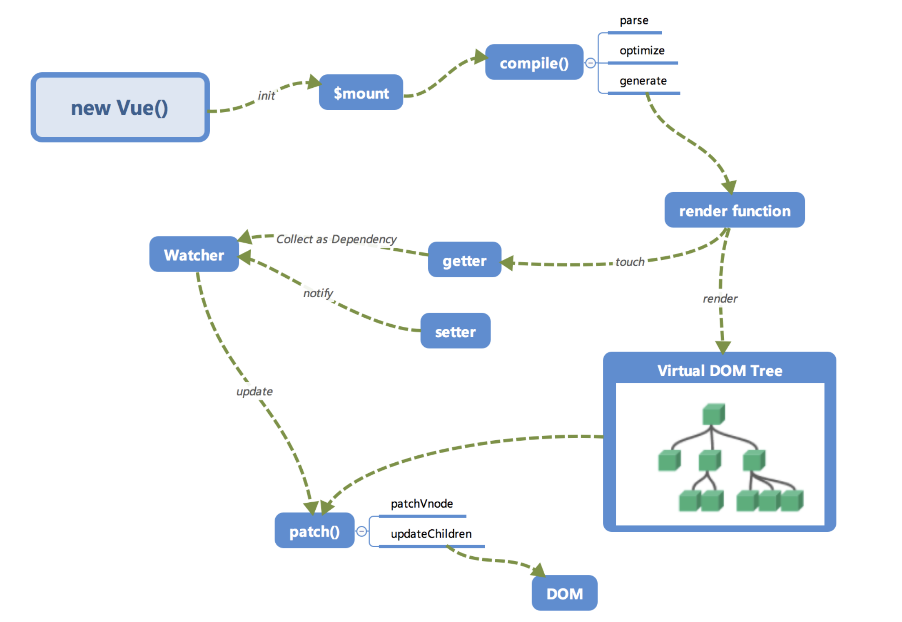
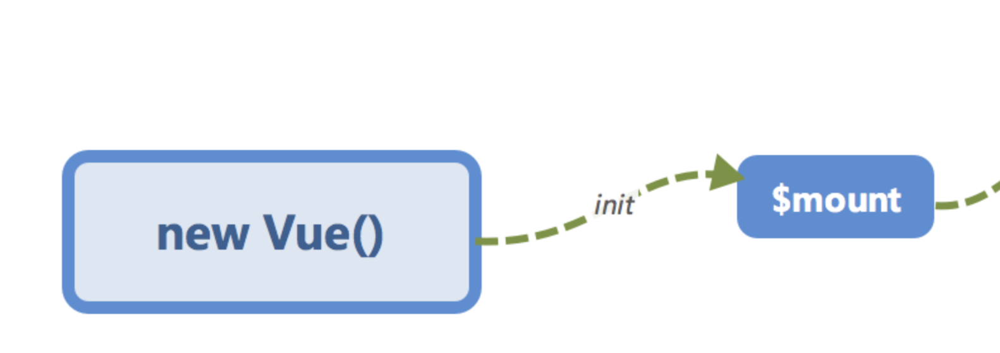
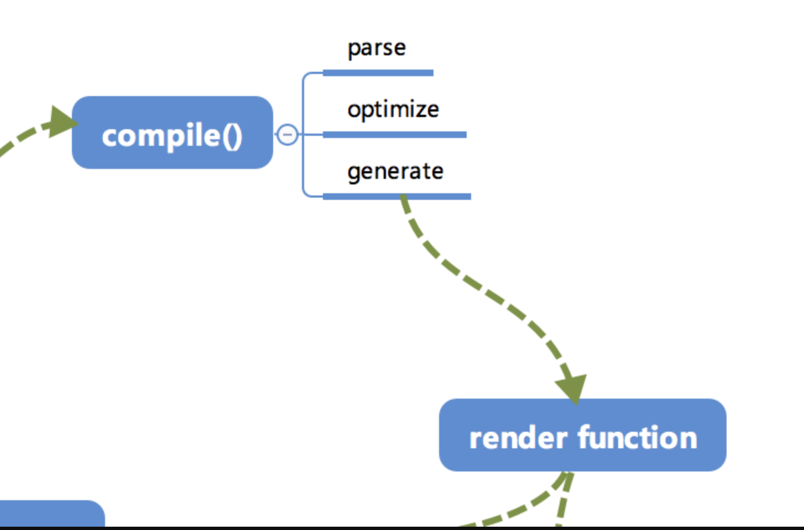
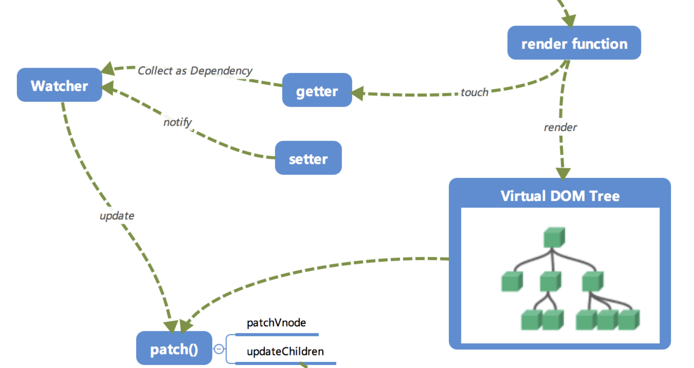
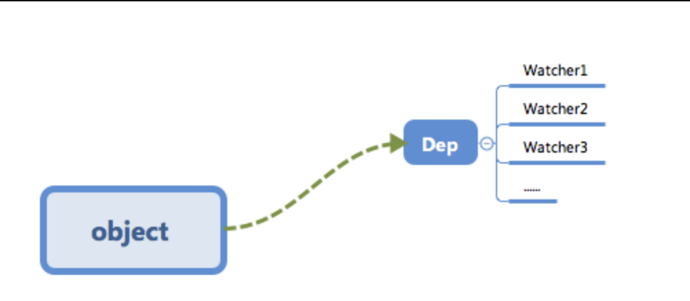
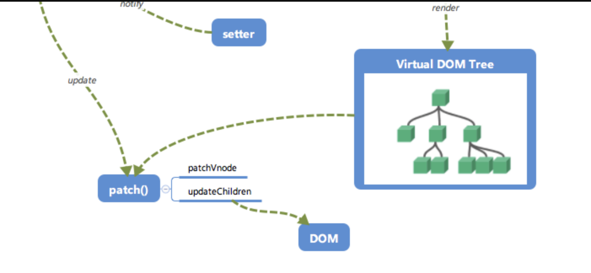

# 原理理解相关

https://zhuanlan.zhihu.com/p/569928112

## MVVM 的理解？

**回答范式：**

<b>MVVM</b> 是 <b>Model-View-ViewModel</b>缩写，也就是把<b>MVC</b>中的<b>Controller</b>演变成<b>ViewModel</b>。<b>Model</b>层代表数据模型，<b>View</b>代表 UI 组件，<b>ViewModel</b>是<b>View</b>和<b>Model</b>层的桥梁，数据会绑定到<b>viewModel</b>层并自动将数据渲染到页面中，视图变化的时候会通知<b>viewModel</b>层更新数据。

## SPA 的理解？

**回答范式：**

<b>SPA</b>（ single-page application ）仅在 Web 页面初始化时加载相应的 HTML、JavaScript 和 CSS。一旦页面加载完成，SPA 不会因为用户的操作而进行页面的重新加载或跳转；取而代之的是利用路由机制实现 HTML 内容的变换，UI 与用户的交互，避免页面的重新加载。

**优点：**

- 用户体验好、快，内容的改变不需要重新加载整个页面，避免了不必要的跳转和重复渲染；
- 基于上面一点，SPA 相对对服务器压力小；
- 前后端职责分离，架构清晰，前端进行交互逻辑，后端负责数据处理

**缺点：**

- 初次加载耗时多：为实现单页 Web 应用功能及显示效果，需要在加载页面的时候将 JavaScript、CSS 统一加载，部分页面按需加载；
- 前进后退路由管理：由于单页应用在一个页面中显示所有的内容，所以不能使用浏览器的前进后退功能，所有的页面切换需要自己建立堆栈管理；
- SEO 难度较大：由于所有的内容都在一个页面中动态替换显示，所以在 SEO 上其有着天然的弱势

## Vue 的完整运行原理？

完整流程图：

### 1. 初始化及挂载

在 <b>new Vue()</b> 之后。 Vue 会调用 <b>\_init</b> 函数进行初始化，也就是这里的 init 过程，它会初始化**生命周期**、**事件**、 **props**、 **methods**、 **data**、 **computed** 与 **watch** 等。其中最重要的是通过 <b>Object.defineProperty</b> 设置 setter 与 getter 函数，用来实现<b>「响应式」</b>.

初始化之后调用 <b>$mount</b> 会挂载组件，如果是运行时编译，即不存在 render function 但是存在 template 的情况，需要进行<b>「编译」</b>步骤

### 2. 编译

compile 编译可以分成 <b>parse</b>、<b>optimize</b> 与 <b>generate</b> 三个阶段，最终需要得到 render function。

**1. parse（解析生成 AST）**

<b>parse</b> 会用正则等方式解析 template 模板中的指令、class、style 等数据，形成 AST。

**2. optimize（标记优化）**

<b>optimize</b> 的主要作用是标记 <b>static</b> 静态节点，这是 Vue 在编译过程中的一处优化，后面当 <b>update</b> 更新界面时，会有一个 <b>patch</b> 的过程， <b>diff</b> 算法会直接跳过静态节点，从而减少了比较的过程，优化了 <b>patch</b> 的性能。

**3. generate（生成代码）**

<b>generate</b> 是将 <b>AST</b> 转化成 <b>render function</b>字符串的过程，得到结果是 <b>render</b> 的字符串以及 <b>staticRenderFns</b> 字符串。

在经历过 <b>parse</b>、<b>optimize</b> 与 <b>generate</b> 这三个阶段以后，组件中就会存在渲染 <b>VNode</b> 所需的 <b>render function</b> 了。

### 3. 响应式以及 render function

当 <b>render function</b> 被渲染的时候，因为会读取所需对象的值，所以会触发 <b>getter</b> 函数进行 **「依赖收集」**， **「依赖收集」** 的目的是将观察者 <b>Watcher</b> 对象存放到当前闭包中的订阅者 <b>Dep</b> 的 <b>subs</b> 中。形成如下所示的这样一个关系。

在修改对象的值的时候，会触发对应的 setter， setter 通知之前 **「依赖收集」** 得到的 Dep 中的每一个 Watcher，告诉它们自己的值改变了，需要重新渲染视图。这时候这些 Watcher 就会开始调用 <b>update</b> 来更新视图，当然这中间还有一个 <b>patch</b> 的过程以及使用队列来<b>异步更新</b>的策略

### 4. 虚拟 DOM 更新视图

- 当数据变化后，执行 render function 就可以得到一个新的 VNode 节点，我们如果想要得到新的视图，最简单粗暴的方法就是直接解析这个新的 VNode 节点，然后用 innerHTML 直接全部渲染到真实 DOM 中。但是其实我们只对其中的一小块内容进行了修改，这样做似乎有些「浪费」。

- 那么我们为什么不能只修改那些「改变了的地方」呢？这个时候就要介绍我们的「patch」了。我们会将新的 VNode 与旧的 VNode 一起传入 patch 进行比较，经过 diff 算法得出它们的「差异」。最后我们只需要将这些「差异」的对应 DOM 进行修改即可。

## Vue 从初始化到实例挂载都发生了什么（new Vue）？

这个过程主要有两件事：<b>初始化</b> 和 <b>建立更新机制</b>

**1. 初始化**

- **合并配置项：**
  - 初始化根组件时进行了选项合并操作，将全局配置合并到根组件的局部配置上
  - 初始化每个子组件时做了一些性能优化，将组件配置对象上的一些深层次属性放到 vm.$options 选项中，以提高代码的执行效率
- **初始化组件实例的关系属性：** 比如 $parent、$children、$root、$refs 等
- **初始化生命周期**
- **初始化事件中心**
- **初始化渲染函数**
- **调用 `beforeCreate` 钩子函数**
- **初始化 data、props、computed、watcher 响应式处理**
- **调用 `created` 钩子函数**
- 如果发现配置项上有 el 选项，则自动调用 `$mount` 方法，也就是说有了 el 选项，就不需要再手动调用 $mount 方法，反之，没提供 el 选项则必须调用` $mount`
- **接下来则进入`挂载阶段`**

**2. 建立更新机制**

建立更新机制这一步会立即执行一次组件更新函数，这会首次执行组件渲染函数并执行 <b>patch</b>将前面获得 <b>vnode</b> 转换为 <b>dom</b>；同时首次执行渲染函数会创建它内部响应式数据之间和组件更新函数之间的依赖关系（创建 Watcher 实例、触发依赖收集等），这使得以后数据变化时会执行对应的更新函数。

**结论**

- <b>new Vue</b>的时候调用会调用<b>\_init</b>方法 进行一系列的初始化工作
- 调用<b>$mount</b>进行页面的挂载
- 挂载的时候主要是通过<b>mountComponent</b>方法
- 定义<b>updateComponent</b>更新函数
- 执行<b>render</b>生成<b>虚拟 DOM</b>
- <b>\_update</b>将 <b>虚拟 DOM</b> 生成 <b>真实 DOM</b>结构，并且渲染到页面中

## Vue 的响应式原理？

> 所谓**响应式** 就是 能够检测出数据的变化，并对这种变化做出相应的机制。

整体流程 3 步：

1. **数据劫持**（变为响应式）
2. **依赖收集**
3. **派发更新**

在 vue 中首先通过 Observer 这个类来实现对象的每一个属性以及嵌套的属性（对象，递归处理）进行数据劫持，通过调用`defineReactive`方法，其核心使用的是 `Object.defineProperty` 的 get 和 set， 来实现**数据劫持**。

并且会在`defineReactive`方法中进行实例化 Dep，每一个属性对应一个 Dep，在读取属性的时候会触发 `Object.defineProperty` 的 get 中 来进行 **依赖收集**。 `dep.depend()` **依赖收集**的是 Watcher 实例，watcher 中保存着**依赖回调**。

**依赖收集**触发的时机是在 实例化 Watcher 的时候（ 初始化过程会进行组件的挂载并创建对应渲染 watcher），会把 Dep.target 设置为当前 wacher 实例，紧跟着 get 方法会去访问 vm 中对应 key 的属性，从而引发 defineReactive 的 getter，里面发现已经设置了 Dep.target，所以会调用 Dep.depend 来将该 target 加入到 defineReactive 闭包维护的对应属性的 dep 对象的 subs 数组中。

Watcher 的 get 方法继续执行，并将 Dep.target 设置成 null，从而结束**依赖收集**

然后我们修改数据的时候会触发 `Object.defineProperty` 的 set，进行 **依赖回调/派发更新** `dep.notify()`通知所有依赖该属性的 watcher 进行更新。

只不过在更新的时候不是立即执行 render 函数，而是把要更新的 watcher 维护到了一个异步队列，它会通过一个叫做 nextTick 的工具方法，把这些需要执行的 watcher 放入到事件循环的微队列中，nextTick 的具体做法是通过 Promise 完成的，nextTick 其实就是一个函数。

## Vue 是如何检测数组的？

Vue 不能检测到以下数组的变动：

- 当你利用索引直接设置一个数组项时，例如：`vm.items[indexOfItem] = newValue`
- 当你修改数组的长度时，例如：`vm.items.length = newLength`

可以使用 Vue.set()或者修改数组的 7 个原型方法。

## Proxy 相比 Object.defineProperty 的优势？

<b>Object.defineProperty()</b> 的问题主要有三个：

- **不能监听数组的变化：** 无法监控到数组下标的变化，导致通过数组下标添加元素，不能实时响应
- **必须遍历对象的每个属性：** 只能劫持对象的属性，从而需要对每个对象，每个属性进行遍历，如果属性值是对象，还需要深度遍历。Proxy 可以劫持整个对象，并返回一个新的对象
- **必须深层遍历嵌套的对象**

<b>>Proxy 的优势如下:</b>

- 针对对象：针对整个对象，而不是对象的某个属性，所以也就不需要对 keys 进行遍历
- 支持数组：Proxy 不需要对数组的方法进行重载，省去了众多 hack，减少代码量等于减少了维护成本，而且标准的就是最好的
- Proxy 的第二个参数可以有 13 种拦截方：不限于 apply、ownKeys、deleteProperty、has 等等是 Object.defineProperty 不具备的
- Proxy 返回的是一个新对象,我们可以只操作新的对象达到目的,而 Object.defineProperty 只能遍历对象属性直接修改
- Proxy 作为新标准将受到浏览器厂商重点持续的性能优化，也就是传说中的新标准的性能红利

## Vue.set 使用场景 和 实现原理？

- **如果目标是数组**，直接使用数组的 <b>splice</b> 方法触发相应式；
- **如果目标是对象**，会先判读属性是否存在、对象是否是响应式，最终如果要对属性进行响应式处理，则是通过调用 <b>defineReactive</b> 方法进行响应式处理（ defineReactive 方法就是 Vue 在初始化对象时，给对象属性采用 Object.defineProperty 动态添加 getter 和 setter 的功能所调用的方法）

## Vue 是如何进行依赖收集的？

在组件挂载后，实例化 watcher，首次渲染触发 把 watcher 实例指向到 Dep.target 后。通过 Object.defineProperty 进行数据劫持的属性，进行 dep.depend 进行 依赖收集。

## Vue 是什么时候实例化 Watcher 的？

是实例挂载之后，mountComponent 中进行实例化 Watcher 的。

## Watcher 分别有哪些？

1. 渲染 wacher
2. 用户 wacher
3. 计算属性 watcher

## Vue 的生命周期有哪些？

Vue 生命周期总共分为 8 个阶段<b>创建前/后</b>，<b>载入前/后</b>，<b>更新前/后</b>，<b>销毁前/后</b>

**---------------创建阶段--------------**

- **beforeCreate：** 在这个阶段，做了一些选项的合并优化，初始化组件实例的关系属性，比如 $parent、$children、$root、$refs 等，初始化了自定义事件等。注意：这时候 data 和 method 等中的数据还没有初始化。通常用于插件开发中执行一些初始化任务。

- **created：** 在这个阶段，初始化 provide/inject 等，初始化 props、data、methods、computed、watch 等并且对其做代理以及响应式处理。如果要调用 methods 中的方法或者 data 中的数据，最早只能在`created`中操作。

- **beforeMount：** 在这个阶段是 组件挂载之前。（完成了 data 和 el 数据初始化），模板已经在内存中编译好了，相关的 render 函数首次被调用，但未挂载到页面中。在这里可以在渲染前最后一次更改数据的机会，不会触发其他的钩子函数，一般可以在这里做初始数据的获取。

- **mounted：** 在这个阶段，把已经编译好的模板替换到页面中。最早可以在`mounted`中操作 dom。执行完了 mounted, 表示整个 vue 实例完全初始化完毕。此时脱离了创建阶段，开始了运行阶段。

**---------------运行阶段--------------**

- **beforeUpdate：** 组件数据更新之前调用，发生在虚拟 <b>DOM</b> 打补丁之前

- **update：** 由于数据更改导致的虚拟 <b>DOM</b> 重新渲染和打补丁，在这之后会调用该钩子

**---------------销毁阶段--------------**

- **beforeDestroy（beforeUnmount）：** 组件实例销毁之前，这时候组件实例的 data、methods 等还可以使用，一般在这里处理一些销毁之前做的事情，比如取消定时器等。

- **destroy（unmounted）：** 此时组件实例已经完全销毁，组件中所有的数据等都不可以使用了。

## Vue 父子组件生命周期钩子顺序？

**加载渲染过程**

父 `beforeCreate`->父 `created`->父 `beforeMount`->子 `beforeCreate`->子 `created`->子 `beforeMount`->子 `mounted`->父 `mounted`。子组件先挂载，然后到父组件

**子组件更新过程**

父 `beforeUpdate`->子 `beforeUpdate`->子 `updated`->父 `updated`

父组件更新过程

父 `beforeUpdate`->父 `updated`

销毁过程

父 `beforeDestroy`->子 `beforeDestroy`->子 `destroyed`->父 `destroyed`

## 父组件可以监听到子组件的生命周期吗？

@hook 方法不仅仅是可以监听 mounted，其它的生命周期事件，例如：created，updated 等都可以监听

## Vue 中的模板编译原理？

<b>Vue</b> 的编译过程就是将 <b>template</b> 转化为 <b>render</b> 函数的过程

- 解析生成 AST 树 将 template 模板转化成 AST 语法树，使用大量的正则表达式对模板进行解析，遇到标签、文本的时候都会执行对应的钩子进行相关处理
- 标记优化 对静态语法做静态标记 markup(静态节点如 div 下有 p 标签内容不会变化) diff 来做优化 静态节点跳过 diff 操作
  - Vue 的数据是响应式的，但其实模板中并不是所有的数据都是响应式的。有一些数据首次渲染后就不会再变化，对应的 DOM 也不会变化。那么优化过程就是深度遍历 AST 树，按照相关条件, 对树节点进行标记。这些被标记的节点(静态节点)我们就可以跳过对它们的比对，对运行时的模板起到很大的优化作用
  - 等待后续节点更新，如果是静态的，不会在比较 children 了
- 代码生成 编译的最后一步是将优化后的 AST 树转换为可执行的代码

## Vue 中编译器何时执行？

初始化之后调用 <b>$mount</b> 会挂载组件，如果是运行时编译，即不存在 <b>render function</b> 但是存在 <b>template</b> 的情况，需要进行「编译」步骤

## 谈谈虚拟 DOM 以及实现原理？

## 谈谈 diff 算法原理?

## 既然 Vue 通过数据劫持可以精准探测数据变化，为什么还需要虚拟 DOM 进行 diff 检测差异？

## Vue 中 key 的作用和原理，谈谈你对它的理解？

## nextTick 的使用场景 和 原理？

- <b>nextTick</b> 中的回调是在下次 <b>DOM</b> 更新循环结束之后执行延迟回调，用于获得更新后的 <b>DOM</b>
- 在修改数据之后立即使用这个方法，获取更新后的 <b>DOM</b>
- 主要思路就是采用微任务优先的方式调用异步方法去执行 <b>nextTick</b> 包装的方法

## 为什么 Vue 采用异步渲染？

Vue 是组件级更新，如果不采用异步更新，那么每次更新数据都会对当前组件进行重新渲染，所以为了性能， Vue 会在本轮数据更新后，在异步更新视图。核心思想 <b>nextTick</b>

## Vue 数据双向绑定的原理？

## v-model 实现原理？

## Vue 中修饰符.sync 与 v-model 的区别？

## keep-alive 的原理和使用场景？

## 实现一个 LRU(最近最少使用) 算法？

LRU 的核心思想是如果数据最近被访问过，那么将来被访问的几率也更高，所以我们将命中缓存的组件 key 重新插入到 this.keys 的尾部，这样一来，this.keys 中越往头部的数据即将来被访问几率越低，所以当缓存数量达到最大值时，我们就删除将来被访问几率最低的数据，即 this.keys 中第一个缓存的组件。

---

## 谈谈组件化的理解？

## Vue 组件为什么只能有一个根元素？

## Vue 组件渲染和更新过程？

## Vue 组件的通信方式有哪些？

## 组件写 name 属性的好处？

## Vue.extend 的作用和原理？

## 如何扩展一个组件？

## 子组件可以修改父组件的数据吗？

## 什么是异步组件以及使用场景？

## 什么是递归组件以及使用场景？

## Vue 如何注册组件？

## Vue 如何实现插件？

## Vue 如何做 SSR？

## Vue 性能优化有哪些？

1. 编码阶段

- 尽量减少 data 中的数据，data 中的数据都会增加 getter 和 setter，会收集对应的 watcher
- v-if 和 v-for 不能连用
- 如果需要使用 v-for 给每项元素绑定事件时使用事件代理
- SPA 页面采用 keep-alive 缓存组件
- 在更多的情况下，使用 v-if 替代 v-show
- key 保证唯一
- 使用路由懒加载、异步组件
- 防抖、节流
- 第三方模块按需导入
- 长列表滚动到可视区域动态加载
- 图片懒加载

2. SEO 优化

- 预渲染
- 服务端渲染 SSR

3. 打包优化

- 压缩代码
- Tree Shaking/Scope Hoisting
- 使用 cdn 加载第三方模块
- 多线程打包 happypack
- splitChunks 抽离公共文件
- sourceMap 优化

4. 用户体验

- 骨架屏
- PWA
- 还可以使用缓存(客户端缓存、服务端缓存)优化、服务端开启 gzip 压缩等。

---

# 基础相关

## Vue 组件 data 为什么必须是个函数？

- **根实例对象 data 可以是对象也可以是函数（根实例是单例）**，不会产生数据污染情况
- **组件实例对象 data 必须为函数** .vue 文件在使用的时候实际上会转换成一个 class，一个组件被复用多次的话，也就会创建多个实例。本质上，这些实例用的都是同一个构造函数。如果 data 是对象的话，对象属于引用类型，会影响到所有的实例。所以为了保证组件不同的实例之间 data 不冲突，data 必须是一个函数，

## v-if 和 v-show 的区别？

- **手段：** v-if 是动态的向 DOM 树内添加或者删除 DOM 元素；v-show 是通过设置 DOM 元素的 display 样式属性控制显隐；

- **编译过程：** v-if 切换有一个局部编译/卸载的过程，切换过程中合适地销毁和重建内部的事件监听和子组件；v-show 只是简单的基于 css 切换；

- **编译条件：** v-if 是惰性的，如果初始条件为假，则什么也不做；只有在条件第一次变为真时才开始局部编译; v-show 是在任何条件下，无论首次条件是否为真，都被编译，然后被缓存，而且 DOM 元素保留；

- **性能消耗：** v-if 有更高的切换消耗；v-show 有更高的初始渲染消耗；

- **使用场景：** v-if 适合运营条件不大可能改变；v-show 适合频繁切换。

## v-if 和 v-for 能一起使用吗？

## Vue 的修饰符有哪些？

`​.stop​​`​：等同于 JavaScript 中的 ​​event.stopPropagation()​​ ，防止事件冒泡；
`​​.prevent`​​​ ：等同于 JavaScript 中的 ​​event.preventDefault()​​ ，防止执行预设的行为（如果事件可取消，则取消该事件，而不停止事件的进一步传播）；
`​​.capture​​`：与事件冒泡的方向相反，事件捕获由外到内；
`​​.self​​`：只会触发自己范围内的事件，不包含子元素；
`​​.once​​`：只会触发一次。

## Q：slot 是什么？有什么作用？原理是什么？

slot 又名插槽，是 Vue 的内容分发机制，组件内部的模板引擎使用 slot 元素作为承载分发内容的出口。插槽 slot 是子组件的一个模板标签元素，而这一个标签元素是否显示，以及怎么显示是由父组件决定的。slot 又分三类，**默认插槽**，**具名插槽**和**作用域插槽**。

- **默认插槽**：又名**匿名插槽**，当 slot 没有指定 name 属性值的时候一个默认显示插槽，一个组件内只有有一个匿名插槽。

- **具名插槽**：带有具体名字的插槽，也就是带有 name 属性的 slot，一个组件可以出现多个具名插槽。

- **作用域插槽**：默认插槽、具名插槽的一个变体，可以是匿名插槽，也可以是具名插槽，该插槽的不同点是在子组件渲染作用域插槽时，可以将子组件内部的数据传递给父组件，让父组件根据子组件的传递过来的数据决定如何渲染该插槽。

**原理**

当子组件 vm 实例化时，获取到父组件传入的 slot 标签的内容，存放在`​​vm.$slot​​`​ 中，**默认插槽**为 ​`​vm.$slot.default`​​​，**具名插槽**为`​​vm.$slot.xxx​​`​，xxx 为插槽名，当组件执行渲染函数时候，遇到 slot 标签，使用`​​$slot​`​ 中的内容进行替换，此时可以为插槽传递数据，若存在数据，则可称该插槽为**作用域插槽**。

## Vue.mixin 的使用场景？

## method、computed、watch 的区别和使用场景？

## vue-router 有几种模式？

## vue-router 有哪几种导航守卫？

## 怎么实现路由懒加载？

## Vue 要做权限管理该怎么做？控制到按钮级别的权限怎么做？

## Vuex 是什么以及使用场景？

## Vuex 中 actions 和 mutations 有什么区别？

## Vuex 刷新数据丢失怎么解决？

## Vuex 的模块以及命名空间是什么，怎么用？

## vue 在 v-for 时给每项元素绑定事件需要用事件代理吗？为什么？

## 一般在哪个生命周期请求异步数据？

我们可以在钩子函数 `created`、`beforeMount`、`mounted` 中进行调用，因为在这三个钩子函数中，`data` 已经创建，可以将服务端端返回的数据进行赋值。

推荐在 `created` 钩子函数中调用异步请求，因为在 created 钩子函数中调用异步请求有以下优点：

- 能更快获取到服务端数据，减少页面加载时间，用户体验更好；
- `SSR`不支持 `beforeMount` `、mounted` 钩子函数，放在 `created` 中有助于一致性。
